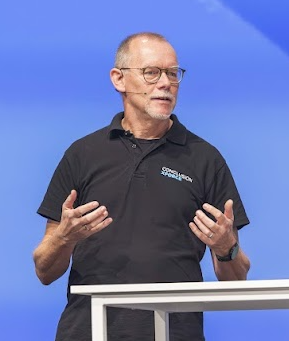

## whoami

Hi there! I'm Alex, a seasoned automation consultant at [Conclusion Xforce](https://www.conclusionxforce.nl/). Next to that I am the Technical Coach for our Automation (Ansible Automation Platform) focus group, and as a Red Hat Certified Instructor I deliver different Red Hat trainings on a regular base.

## Linux

While studying mechanical engineering at Eindhoven University of Technology, I was introduced to something new: a stack of 3.5" floppy disks and on it a Unix operating system for IBM PC, and it was free. Its name was Linux; my first distribution was Slackware and the year was 1993. And I never let go again - despite dealing with account managers who told me Linux would never be a commercially viable choice, I kept playing and working with it. Got my first Red Hat Certified Engineer certification 25 years ago, in the year 2000 when the RHCE program was freshly introduced. Re-certified on RHEL-3, 5, 7 and 9 (I have a preference for the odd numbers), I became Red Hat Certified Architect in the year 2017.

## Ansible

Around 2014, Configuration Management tools (like Puppet and Cfengine) were hot and booming, but I couldn't get the hang of it. That changed when in 2017 I got a "new" computer, needed to upgrade to RHEL-7 and worried about all the manual stuff that I would have to sort out again. So I decided to automate everything - and I choose Ansible for that. Since that moment I've been fully focused on Ansible and the Ansible Automation Platform. Certified on all Red Hat exams related to Ansible, I can say that I know my way around with it. And happy to share that knowledge, e.g. on Red Hat Summit Connect and our own Conclusion Xforce Impact event.

## Let's Connect

If you want to know more about me, check out my [LinkedIn profile](https://www.linkedin.com/in/alex-bron/). If you want to engage with me regarding your Ansible and automation challenges, please reach out to Iliass Laghmouchi or Mark Dudock, our account managers at Conclusion Xforce.
