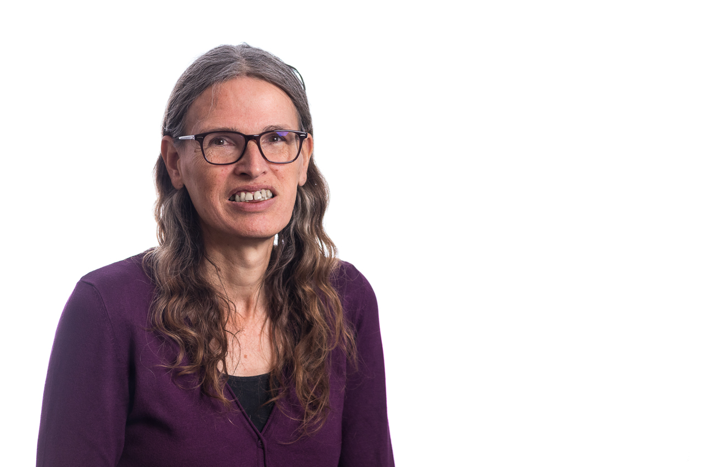

## Frederique

Hi there! I'm Frederique, I work for
[Conclusion Xforce](https://www.conclusionxforce.nl/) as a consultant for AWS
and Kubernetes. I'm also the Technical Coach for our cloud (AWS + Azure) focus
group. I love to share my knowledge via presentations and blogs.

## Presentations

Once a year I'm one of the presenters of a presentation about new developments
in AWS, based on AWS re:Invent. Last year I also presented part of the
presentation about KubeCon 2025 in London.

For more information about the presentations that Conclusion Xforce is about to
give, see our [meetup page](https://www.meetup.com/nl-NL/xforce-kennissessies/).

## Blogs

For the blogs that I wrote on this blog site, search on my name in the search
bar. In the past I also wrote
[blogs for Conclusion AMIS](https://technology.amis.nl/author/frederique-retsemaamis-nl/).

## LinkedIn

When you want to know more about me, look at my
[LinkedIn profile](https://www.linkedin.com/in/frederiqueretsema/). You can
also contact Iliass Laghmouchi, our account manager: he can send you my CV if
you're interested in hiring me.
