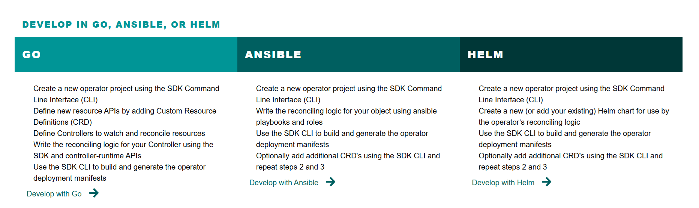
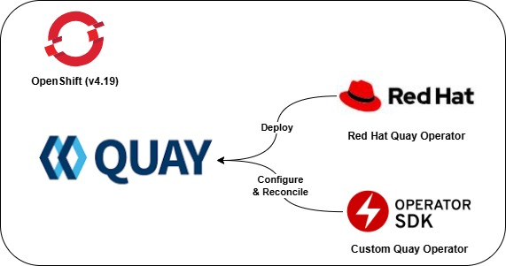
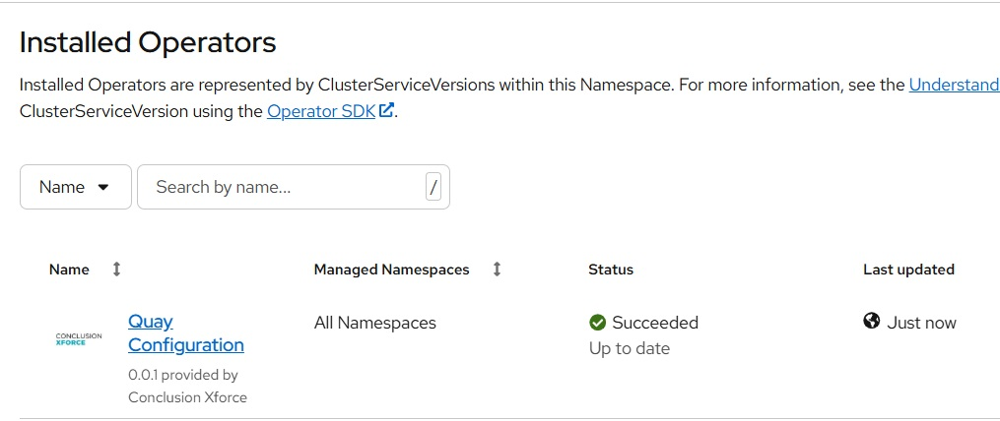
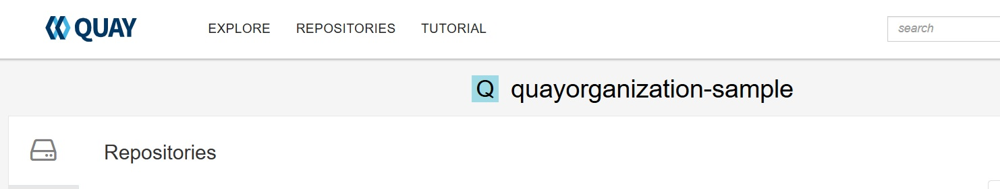

## The problem

We have all been there.
You finally found an operator to deploy your favorite application.
Unfortunately, the operator only manages the deployment not the
actual configuration. In this specific case I want to manage Quay (container registry)
and its organizations declaratively to embed it in the onboarding template for teams.
Having a sysadmin background the task of writing a GO operator to manage
organizations in Quay using the REST API seems daunting.
Luckily the [Operator SDK](https://sdk.operatorframework.io/) also supports Ansible.

## The tool


Ref: `https://sdk.operatorframework.io/`

"The Operator SDK provides the tools to build, test, and package Operators."
The SDK offers three ways to build your operator: 1) Go 2) Ansible 3) Helm Charts.
To solve the current problem, Ansible has my preference.
Ansible has an active community that maintains a wide
variety of collections including the quay_configuration collection
 maintained by the [Red Hat Communities of Practice](https://github.com/redhat-cop).
It saves a lot of time to simply reuse existing collections and roles
instead of writing them from scratch.

## The solution



### Prerequisites

The rest of the blog describes the steps to create an Ansible Operator
for Quay. The following prerequisites are required:

* OpenShift Cluster
* Quay Instance
* Access token to Quay with full administrative permissions
* Container registry to store the container images

### Building the operator

1. On your system (Linux or macOs) install
the operator-sdk ([see documentation](https://sdk.operatorframework.io/docs/installation/)).

2. Initialize a template project for the ansible operator
and create its first api: QuayOrganization.

   ```bash
   mkdir quay-configuration && cd quay-configuration
   operator-sdk init --plugins=ansible --domain conclusionxforce.cloud
   operator-sdk create api --group quay --version v1alpha1 --kind QuayOrganization --generate-playbook
   ```

3. Add the quay_configuration collection to the `requirements.yml`
to make sure it is included in the controller image.

   ```yaml
   ./requirements.yml
   
   ...
     - name: infra.quay_configuration
       version: "2.5.2"
   ...
   ```

4. Create the default playbook in `playbooks/quayorganization.yml`.

    4.1 Add the tasks to retrieve the secret containing the superadmin token in Kubernetes.

    ```yaml
    ---
    - hosts: localhost
      gather_facts: no
      collections:
      - kubernetes.core
      - operator_sdk.util
      - infra.quay_configuration
      tasks:
      - name: Get the Quay Instance secret
        kubernetes.core.k8s_info:
          kind: Secret
          namespace: "{{ ansible_operator_meta.namespace }}"
          name: "{{ quay_secret.name }}"
        register: quay_secret_result
    ```

    4.2 Define Quay Configuration task.
    Take a look at the value for `quay_org_name`.
    We use reuse the metadata.name field from the QuayOrganization resource.

    ```yaml
      - name: Ensure the organization exists
        include_role:
          name: infra.quay_configuration.quay_org
        vars:
          # Connection parameters
          quay_org_host: "{{ quay_secret_result.resources[0].data.quayHost | b64decode }}"
          quay_org_token: "{{ quay_secret_result.resources[0].data.quayToken | b64decode }}"
          quay_validate_certs: "{{ quay_secret_result.data.quayValidateCerts | b64decode }}"
          # Organization name and email
          quay_org_name: "{{ ansible_operator_meta.name }}"
          quay_org_prune: "{{ quay_prune | default([]) }}" 
          quay_org_users: "{{ quay_users | default([]) }}" 
          quay_org_robots: "{{ quay_robots | default([]) }}" 
          quay_org_teams: "{{ quay_teams | default([]) }}" 
          quay_org_default_perms: "{{ quay_default_perms | default([]) }}" 
          quay_org_applications: "{{ quay_applications | default([]) }}" 
          quay_org_repositories: "{{ quay_repositories | default([]) }}" 
    ```

5. Now it is time to adjust the generated Custom Resource Definition.
The CRD defines the schema for our `quayorganization` resource.
For the sake of the blog, I have only defined a few fields.
The `x-kubernetes-preserve-unknown-fields` makes it possible to define other fields
without including them in the CRD.
In a production environment you would want to define the CRDs as precise as possible.

   ```yaml
   config/crd/bases/quay.conclusionxforce.cloud_quayorganizations.yaml
   ...
     - name: v1alpha1
       schema:
         openAPIV3Schema:
           description: QuayOrganization is the Schema for the quayorganizations API
           properties:
             apiVersion:
               description: 'APIVersion defines the versioned schema of this representation
                 of an object. Servers should convert recognized schemas to the latest
                 internal value, and may reject unrecognized values. More info: https://git.k8s.io/community/contributordevel/        sig-architecture/api-conventions.md#resources'
               type: string
             kind:
               description: 'Kind is a string value representing the REST resource this
                 object represents. Servers may infer this from the endpoint the client
                 submits requests to. Cannot be updated. In CamelCase. More info: https://git.k8s.io/community/   contributordevel/     sig-architecture/api-conventions.md#types-kinds'
               type: string
             metadata:
               type: object
             spec:
               description: Spec defines the desired state of QuayOrganization
               type: object
               x-kubernetes-preserve-unknown-fields: true
               properties:
                 quaySecret:
                   description: QuaySecret defines a secret containing the information regarding your quay instance
                   type: object
                   properties:
                     name:
                       description: Name of the Kubernetes Secret containing quay information containing (quayHostquayUser,         quayPassword, quayValidateCerts)
                       type: string
   ...
   ```

6. Next step is to create a sample resource. Easy to use for testing!

   ```yaml
   config/samples/quay_v1alpha1_quayorganization.yaml
   
   apiVersion: quay.conclusionxforce.cloud/v1alpha1
   kind: QuayOrganization
   metadata:
     labels:
       app.kubernetes.io/name: quay-configuration-operator
       app.kubernetes.io/managed-by: kustomize
     name: quayorganization-sample
   spec:
     quaySecret:
       name: quay-secret
   ```

7. For native Kubernetes resources (like deployments or services)
the operator will automatically delete
the resources when the custom resource is deleted. This operator,
however, configures Quay through the REST API, so we have to explicitly tell
the operator to delete an organization in Quay upon the
deletion of the resource, using a finalizer playbook.

    7.1 Create the delete-organization playbook.

    ```yaml
    playbooks/delete-organization.yml
    ---
    - name: Deleting an organization
      hosts: localhost
      become: false
      gather_facts: false
      collections:
      - kubernetes.core
      - operator_sdk.util
      - infra.quay_configuration
      tasks:
      - name: Get the Quay Instance secret
        kubernetes.core.k8s_info:
          kind: Secret
          namespace: "{{ ansible_operator_meta.namespace }}"
          name: "{{ quay_secret.name }}"
        register: quay_secret_result

      - name: Ensure the organization is deleted
        infra.quay_configuration.quay_organization:
          quay_host: "{{ quay_secret_result.resources[0].data.quayHost | b64decode }}"
          quay_token: "{{ quay_secret_result.resources[0].data.quayToken | b64decode }}"
          validate_certs: "{{ quay_secret_result.resources[0].data.quayValidateCerts | b64decode }}"
          name: "{{ ansible_operator_meta.name }}"
          state: absent
    ```

    7.2 Now add the playbook as a finalizer.

    ```yaml
    watches.yaml
    ---
    # Use the 'create api' subcommand to add watches to this file.
    - version: v1alpha1
      group: quay.conclusionxforce.cloud
      kind: QuayOrganization
      playbook: playbooks/quayorganization.yml
      reconcilePeriod: 5m
      finalizer:
        name: quay.conclusionxforce.cloud
        playbook: playbooks/delete-organization.yml
    # +kubebuilder:scaffold:watch
    ```

    The sharp-eyed reader will notice that I also added a reconcilePeriod of 5 minutes
    to the resource. This will cause the operator to rerun
    the creation playbook every 5 minutes .

8. Generate and customize the cluster service version.

    8.1 Generate the manifests

    ```bash
    operator-sdk generate kustomize manifests --interactive=false
    ```

    8.2 Now finalize your Cluster Service Version file and
    include your name, organization and your favourite logo,

    ```yaml
    config/manifests/bases/quay-configuration-operator.clusterserviceversion.yaml

    apiVersion: operators.coreos.com/v1alpha1
    kind: ClusterServiceVersion
    metadata:
      annotations:
        alm-examples: '[]'
        capabilities: Basic Install
      name: quay-configuration-operator.v0.0.0
      namespace: placeholder
    spec:
      apiservicedefinitions: {}
      customresourcedefinitions: {}
      description: Operator for configuring Quay Organizations
      displayName: Quay Configuration Operator
      icon:
      - base64data: <BASE64 encode picture>
        mediatype: PNG
      install:
        spec:
          deployments: null
        strategy: ""
      installModes:
      - supported: false
        type: OwnNamespace
      - supported: false
        type: SingleNamespace
      - supported: false
        type: MultiNamespace
      - supported: true
        type: AllNamespaces
      keywords:
      - quay
      - xforce
      links:
      - name: Conclusion Xforce
        url: https://conclusionxforce.cloud
      maintainers:
      - email: sven.kooiman@conclusionxforce.nl
        name: sven
      maturity: alpha
      minKubeVersion: 1.27.0
      provider:
        name: Conclusion xForce
      version: 0.0.0
      ```

9. In the `Makefile` change the `IMAGE_TAG_BASE` to the repository where
you will be publishing your operator and change the default controller to
reference this variable.

   ```bash
   ./Makefile
   
   ...
   IMAGE_TAG_BASE ?= quay.io/<your organization>/quay-configuration-operator
   IMG ?= $(IMAGE_TAG_BASE):$(VERSION)
   ...
   ```

10. Build and push your operator to the registry.

    ```bash
    make docker-build docker-push
    ```

11. Create the OLM bundle and push to your container registry.
This step is optional and for OpenShift/Operator Lifecycle Manager only.
It is possible to directly deploy the operator to your local Kubernetes cluster
or run it on your workstation)

    ```bash
    make bundle bundle-build bundle-push
    ```

12. Run the actual operator.

    12.1 Run the command below:

    ```bash
    operator-sdk run bundle quay.io/<your organization>/quay-configuration-operator-bundle:v0.0.1
    ```

    12.2 Check the operator in the OpenShift Console

    

13. Deploy your first Quay organization.

    13.1 Create the secret containing the Quay token.

    ```bash
    oc create secret generic quay-secret \
      --from-literal=quayHost=<insert QuayURL> \
      --from-literal=quayToken=<insert Quay Token> \
      --from-literal=quayValidateCerts=true
    ```

    13.2 Now create your first custom resource using the sample created earlier

     ```bash
     oc apply -f config/samples/quay_v1alpha1_quayorganization.yaml
     ```

14. Check the status of the resource and Quay.

    14.1 Check the resource using the OpenShift CLI.

    ```bash
    oc get quayorganization quayorganization-sample -o yaml
    ```

    14.2 Check in Quay whether the new organization exists in Quay

    

15. Congratulations you have created your first Ansible based operator!

## The end

Combining Ansible and operators provides the best of both worlds.
You can leverage the ecosystem of Ansible to manage
your application in a cloud native way.
The example of the quay configuration operator needs a lot of finetuning.
Testing with Molecule and more granular CRDs should be added
for a production-ready operator.
Hopefully the blog has inspired you to use an Ansible Operator next time
you need to manage an application in Kubernetes.
