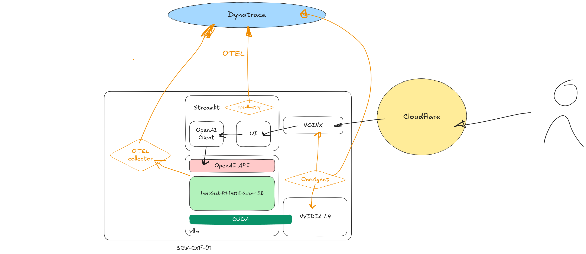
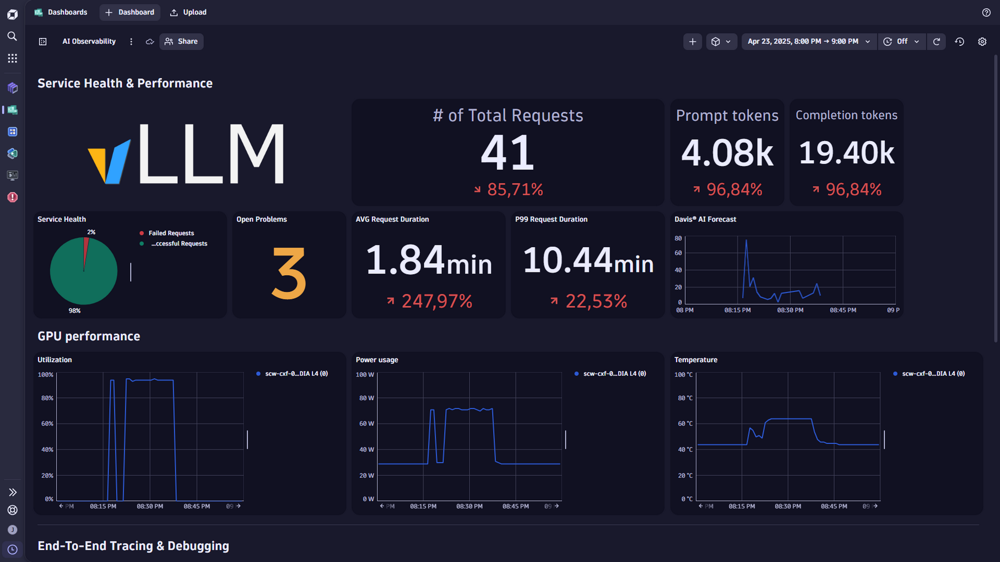
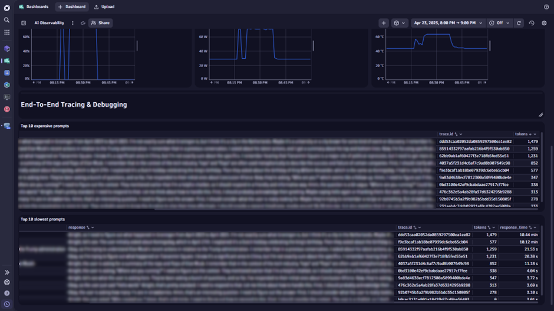
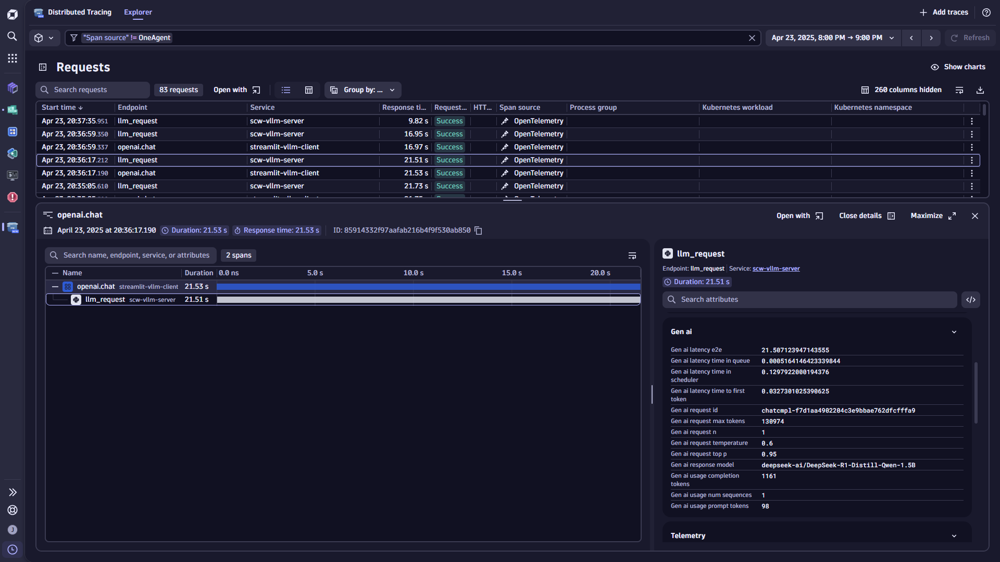

Observability has been a hot topic for quite some time. Even though most
organizations are still in the process of adopting standardized processes
and platforms for gathering, shipping, and analyzing observability data
(logs, metrics and traces) across their IT environments, a new challenge
is approaching fast: generative AI.

Traditional applications are specific, deterministic and have predictable
performance characteristics. Large Language Models (LLMs), however, are a
paradigm shift. LLMs are black boxes, capable of tasks ranging from
summarizing text, generating code, answering questions and more. In short:
they are incredibly powerful, but opaque. As it is extremely easy to
leverage the power of LLMs from traditional applications through standardized
APIs, more and more applications include LLM-powered features. So, measuring
performance, context, input, output, and cost when using LLMs is paramount.

## Open technology to the rescue

[OpenTelemetry](https://opentelemetry.io/) (OTEL) is a collection of APIs,
SDKs, and tools, to instrument, generate, collect, and export telemetry data.
It has emerged as the standard solution for observability, as it is 100% free
and open source, vendor-neutral and adopted and supported by all observability
leaders. [OpenLLMetry](https://github.com/traceloop/openllmetry) (open source,
developed and maintained by [Traceloop](https://www.traceloop.com/) ) builds on
top of OTEL, and makes LLM-powered workloads a first-class citizen in the world
of observability.

I created a chatbot with [Streamlit](https://streamlit.io/), [vLLM](https://github.com/vllm-project/vllm)
and [DeepSeek-R1-Distill-Qwen](https://huggingface.co/deepseek-ai/DeepSeek-R1-Distill-Qwen-1.5B)
running on a server in the [Scaleway](https://scaleway.com/) cloud with an
NVIDIA accelerator to illustrate the combined power of OTEL, OpenLLMetry, and [Dynatrace](https://dynatrace.com/):

As you can see, every call to my LLM is available in Dynatrace, including all
chat context and the amount of input and output tokens. As I have also
instrumented the vLLM model server, more detailed performance metrics are
available for each incoming request, such as time spent in queues and
time-to-first-token. The Dynatrace OneAgent is running on the server, so we
have access to hardware metrics too, giving real-time insight into GPU power
usage and utilization, enabling us to determine the amount of energy used per
request to our model!

In conclusion: as the growth of LLM-powered workloads is increasing, we need to
step up our observability game. Open standards and technologies like OTEL and
OpenLLMetry are ready to solve tomorrow’s observability challenges today. If
you want to see the demo in real life and step up your LLM observability game,
please get in touch!

***Note:** This post originally appeared on [LinkedIn](https://www.linkedin.com/pulse/advanced-observability-llms-jitse-klomp-q6cde)*
