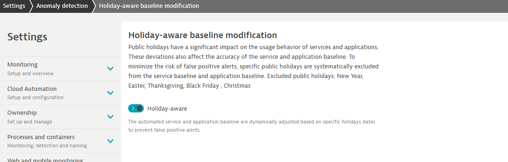
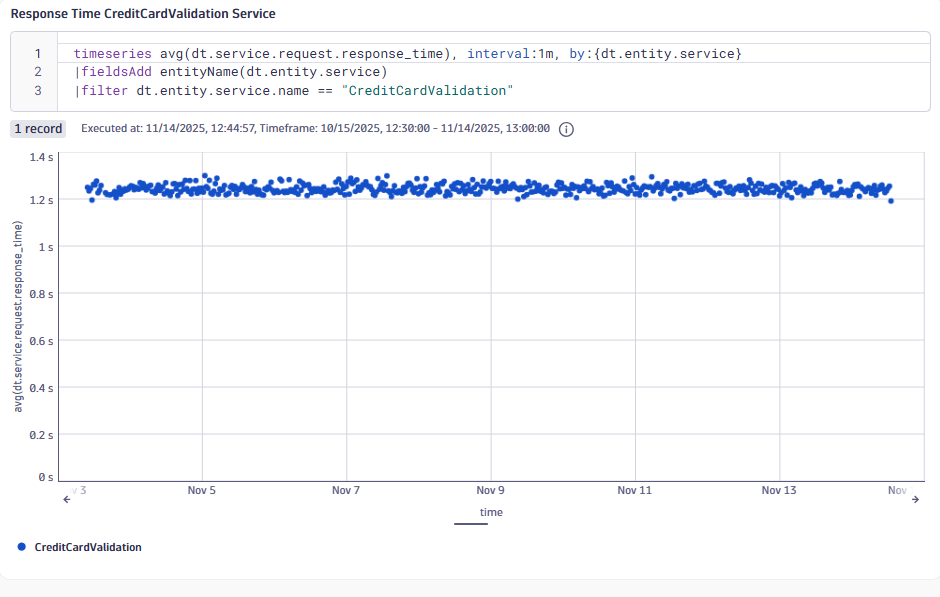
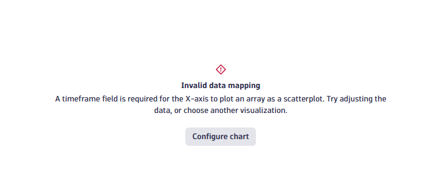
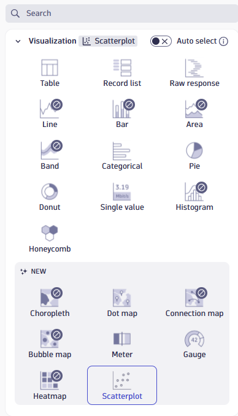
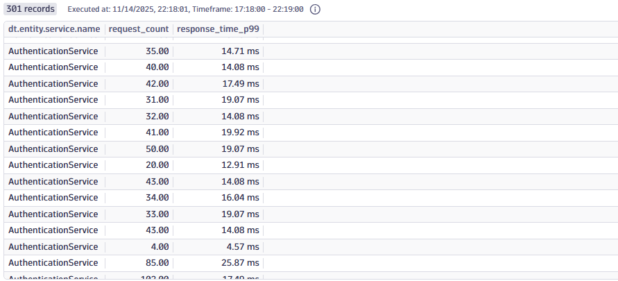
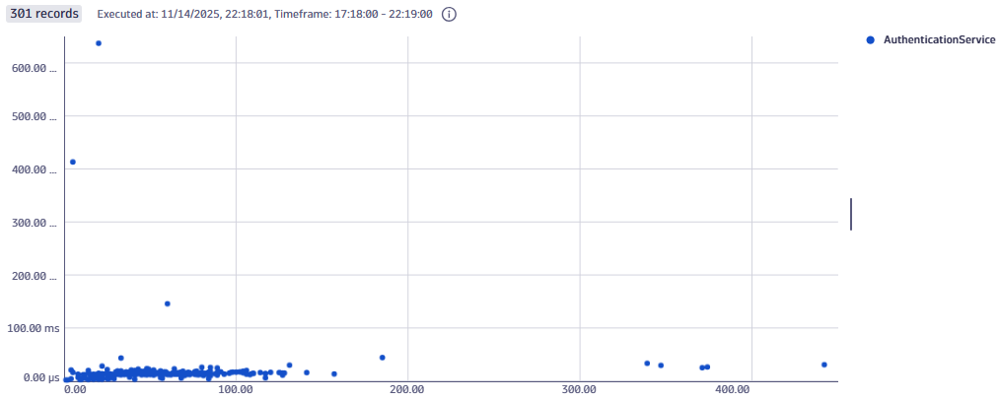
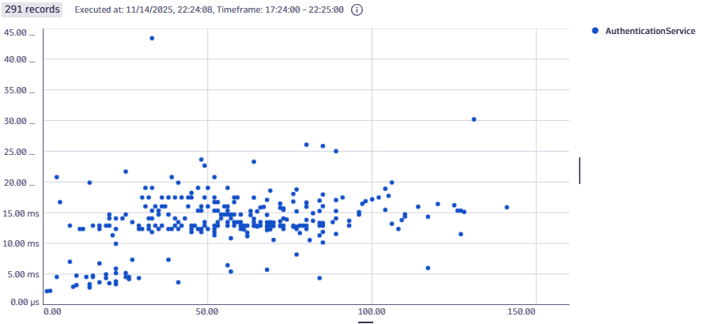
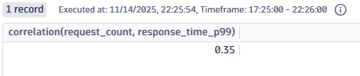
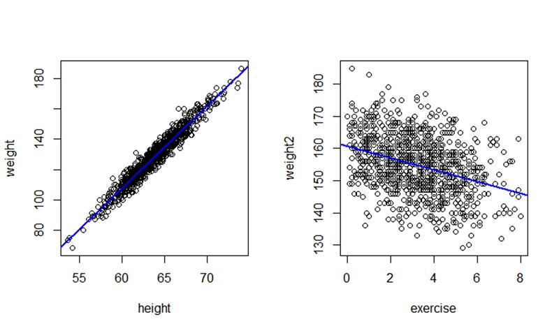
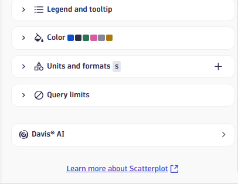

I will try to share and highlight new relevant Dynatrace features (mostly from the Dynatrace release notes)
more frequently - seasoned with my personal opinions, ideas and practical context. 
So, welcome to my new and very first Mini Dynatrace Newsletter!

---------------------------------------------------------------------------------------------------------------------------------------------

## Settings:

## Holiday-aware baseline modification

__When?__ available since 21 oct 2025, SaaS version 1.326 (auto-update, so if you have SaaS this feature is available automatically)
__Summary (from the release notes):__ "Public holidays have a significant impact on the usage behavior of services and applications.
These deviations also affect the accuracy of the service and application baseline.
To minimize the risk of false positive alerts, specific public holidays are systematically excluded from the service baseline and application baseline.
Excluded public holidays are: New Year, Easter, Thanksgiving, Black Friday and Christmas.
This setting is enabled by default.
To disable the feature, go to Settings > Anomaly Detection > Holiday-aware baseline modification."
__Details:__ The holiday-aware baseline modification now is a default setting - applied
immediately after the release of the SaaS 1.326 version
(yes, you and/or your customers are already using it in case you're on SaaS).

This means, that during holidays, there won't be a baseline created for any metric - nevertheless, the data
will still be stored, just not as the new reference baseline.
A week after the holiday, the holiday will not be used as a reference point for performance.
The logic slightly resembles the logic of the "Frequent Issue Detection", as described here:
[Dynatrace Docs - Detection of Frequent Issues](https://docs.dynatrace.com/docs/discover-dynatrace/platform/davis-ai/root-cause-analysis/concepts/detection-of-frequent-issues)
__My 2cts:__ A step in the right direction - and something that many customers asked for.
Unfortunately focused on the American market (holidays in America, not the Dutch holidays and no fine-tuning or holiday-definition possible).
So far, the settings also seem to be mostly focused on "retail" customers.
In the future, I would love to see this feature improved with individual holiday definitions. 
The users KIKON and Anton Pineiro -DynaMight on the Dynatrace community- have created a product idea already. 
If you have a similar view as me and them on the new feature, feel free to upvote and support:
[Dynatrace Community - Define distinct type of days for Holidays-aware baseline](https://community.dynatrace.com/t5/Product-ideas/Define-distinct-type-of-days-Holiday-aware-baseline/idi-p/262812)

## DQL/Dashboards/Notebooks

## Visualize data relationships with the new Scatterplot visualization

__When?__ since 21 oct 2025, SaaS version 1.326 (auto-update, so if you have SaaS this feature is available automatically)
__Summary (from the release notes):__ "You can now use scatterplots in Dashboards Dashboards and Notebooks Notebooks
to visualize data relationships and identify patterns, such as correlations between response time and request count.
This new visualization helps you analyze metrics more effectively and uncover insights in your observability data."
__Mini Demo:__ 
Let us start off easy with a scatterplot of one metric (y-axis) against the timeframe (x-axis), so  a metric over time.
This is a nice alternative to line graphs.

```DQL
timeseries avg(dt.service.request.response_time), by:{dt.entity.service}
|fieldsAdd entityName(dt.entity.service)
|filter dt.entity.service.name == "CreditCardValidation" 
```


If I select a bigger timeframe now, Dynatrace will adjust the interval, meaning that many datapoints will be merged to one.
I am not keen on that, as it defeats the purpose of a scatterplot which is supposed to show all datapoints, but we can avoid it by adding an interval ourselves. Like that:
 
```dql
timeseries avg(dt.service.request.response_time), interval:1m, by:{dt.entity.service}
|fieldsAdd entityName(dt.entity.service)
|filter dt.entity.service.name == "CreditCardValidation"
```

 
Now let's get started on the interesting part, with two different "metric variables" on the x-axis and the y-axis.
A small warning/disclaimer: If you create two metrics as a line chart on a dashboard, you can actually also just append them - less beautiful maybe, but it works.
As we dp want to know the exact y-value for every x-value, to understand their 
relationship (and these values will be shown without their timestamp on the dashboard), this approach will not work (at least not without additional data engineering with DQL).
So you have to use join or lookup commands or create two timeseries immediately in the first step (see my example). More information on joins and lookups: 
[Dynatrace Docs - DQL Correlation and join commands](https://docs.dynatrace.com/docs/discover-dynatrace/platform/grail/dynatrace-query-language/commands/correlation-and-join-commands)

If you want to, you can use the Dynatrace playground to test the queries:
[Dynatrace Playground](https://www.dynatrace.com/signup/playground/)

First, we create two metric timeseries:

```dql
timeseries {response_time_p99 = percentile(dt.service.request.response_time, 99), request_count = sum(dt.service.request.count)}, interval: 1m, by:{dt.entity.service}, union:true
|fieldsAdd entityName(dt.entity.service)
|filter dt.entity.service == "SERVICE-1234567891011"
//enter your own service ID here
```
Unfortunately, we cannot choose the scatterplot visualization immediately. I actually would have liked that...
so we will go for a workaround to make it possible. This is not documented in the release notes or in the Dynatrace Documentation so feel free to follow my steps.




We need to look at a record list, and no longer at two timeseries.
The following commands will convert the timeseries to single records:
 
```dql
// Expanding timeseries to single records
|fields all = iCollectArray(record(response_time_p99= response_time_p99[],request_count = request_count[])),dt.entity.service.name
|expand all
|fieldsAdd request_count = all[request_count], response_time_p99 = all[response_time_p99]
|fieldsRemove all
```

Result: 




Now it makes sense to remove the outliers (a boxplot would be great now to know which ones to exclude, but that feature does not exist in Dynatrace yet).
So, we add the following rules (based on the visual impression of outliers):

```dql
//Removing outliers
|filterOut request_count > 150 //(number of requests)
|filterOut response_time_p99 > 100000 //(100ms)
```

Result:



The amount of requests per minute seems to have a positive relationship with the response time of the slowest 1% requests (more requests are related to a  higher response time).

Let's check if the visual impression of a positive correlation between the "slowest 1% requests" response time and the request count actually exists.
For that, we will add the `|summarize correlation()` command.
 
 ```dql
//Pearson correlation coefficient
|summarize correlation(request_count,response_time_p99)
```
The result is indeed a positive relationship:


 
`|summarize correlation()` already exists for some time, but does fit the use case here, that's why I included it in the newsletter.
__My 2cts:__ Mostly happy.
More dashboarding options and more data science is always a good step forward.
I do miss the option to add a trendline (see the example with R).



For me, this belongs to a good scatterplot.
Unfortunately, there is also no documentation page for scatterplots so far, so the link from the DQL tile does not work yet:



Furthermore, it is not possible yet to simply add two timeseries and turn them into a scatterplot with a normal metrics tile
or DQL tile without intermediate steps (see the error message in this newsletter).
That could be improved in the future to make this feature more accessible to everyone.
---------------------------------------------------------------------------------------------------------------------------------------------
Okay, why would I call this a mini newsletter? (I mean, this was quite a long article...)?
This was only a sub-set of all the new features published in the last weeks.
In the release notes, you can find even more features, but mostly with only a few details and little description.
With these types of newsletters, I am trying to give these improvements and adjustments a bit of practical context and give everyone a chance to test them as soon as possible.