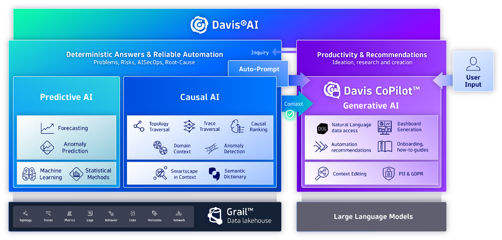
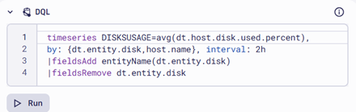
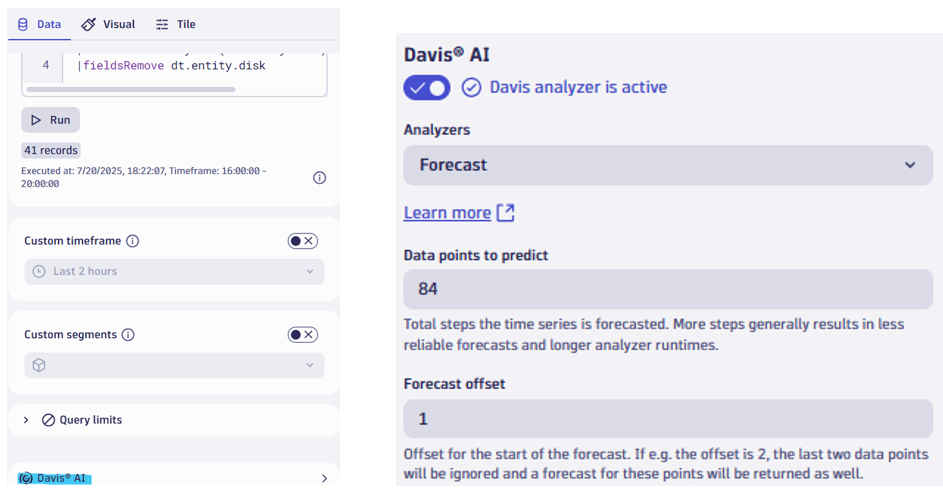
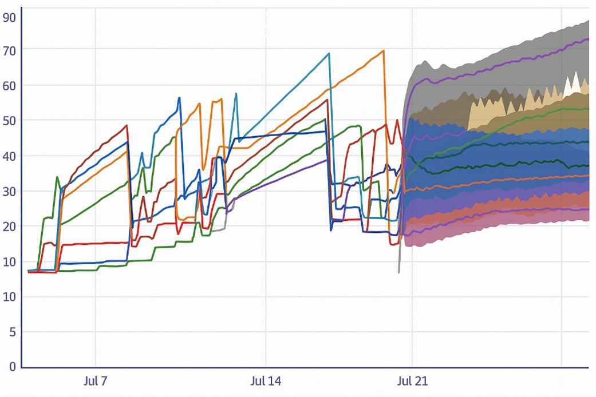
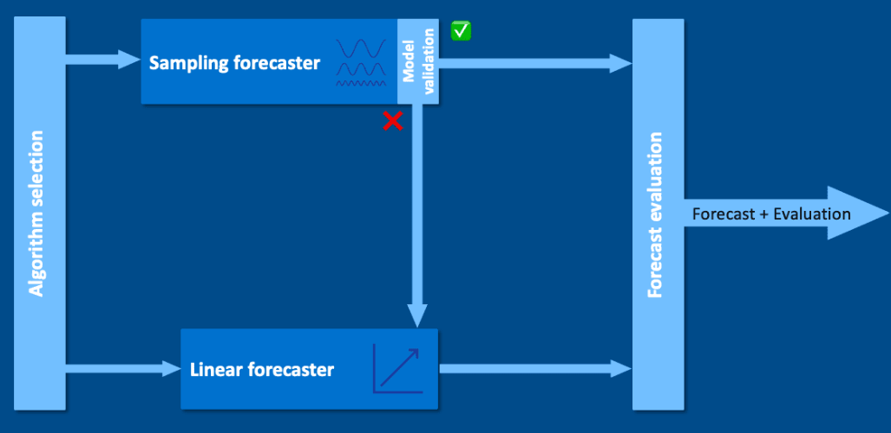
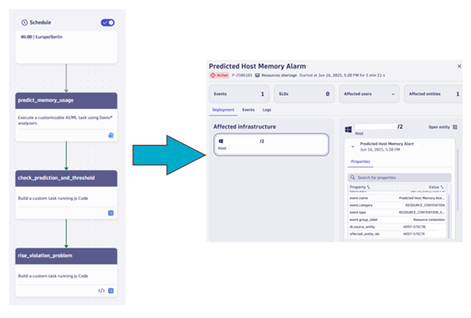
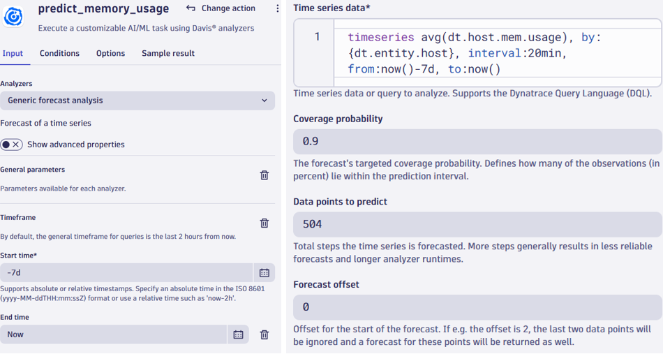
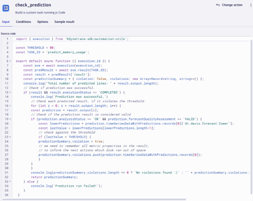
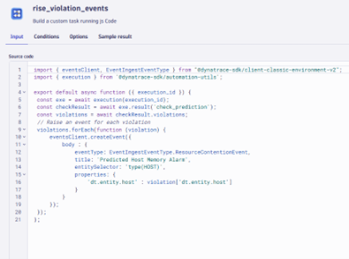
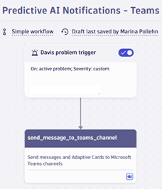

Artificial Intelligence (AI) is a very contemporary topic – also for Observability. While generative AI can probably be seen as the most-discussed topic right now, I have decided to focus on a great and powerful classic. The symbiosis of predictive AI, observability and automation.

Ref: `https://www.dynatrace.com/platform/artificial-intelligence/`

At one of my current assignments, forecast tiles have been added as an essential element to all application dashboards in Dynatrace. Infrastructure forecasting, including memory usage, CPU usage and disk space has become a very easy way for them to avoid larger issues, for which there have been clearly noticeable signs.
There are multiple apps in Dynatrace, which can be used to create the metric forecasts. The dashboards app and the notebook app are the most useful ones if you are also looking for a visualization of the forecast. In your Dynatrace tenant, open the dashboard app and create a DQL (Dynatrace Query Language) tile with the time series of a metric. You can also use my simple query below, which will show the disk usage per disk for every host in my environment. The disk usage is aggregated to an average value every two hours (see the interval).

At the bottom of the data configuration of my tile, I can find a button with Davis AI. I can activate the Davis analyzer and pick Prediction Forecast as my analyzer.

Let’s assume that I want to predict the disk usage of every disk in the environment for the upcoming 7 days. As I am measuring disk usage in a 2 hour interval, new disk usage datapoints will also be predicted in a 2 hour interval. That means, that I will need 84 datapoints to let the forecast cover the upcoming 7 days (7 days x 12 datapoints a day).
For metrics with latency, you should choose for a forecast offset. If I forecast a metric which is based on log counters or values (how to create these with OpenPipeline will be explained in my next blogpost) which requires some computation, I usually include a forecast offset of 1 minute if my chosen time series interval is 1 minute, to prevent “incomplete datapoints” from entering the forecasting model. As that missing datapoint will also be predicted by Davis AI, I usually increase the data points to predict by 1. The maximum forecast offset which I can enter is 10.
As a result, I will get a forecast for the next 7 days with predicted data points with a 2 hour interval. If my forecast fails, this is most likely due to not enough data points being available for the forecast – 14 datapoints are the minimum for a forecasting timeseries. By default, a 90% prediction interval will be added around the predicted disk usage values for each disk, which means that an upper and lower bound of the forecast is included, which makes the forecast more trustworthy. We expect 90% of the future points to lie within the prediction interval.

How are these future values predicted? Depending on the variance in the data, either a sampling forecaster or a linear extrapolation forecaster will be applied. If the variance is large, the sampling forecaster which is accounting for seasonal patterns such as the minute of the hour, the hour of the day or the day of the week, will be applied. With low variance, the linear extrapolation forecaster will be used . A more detailed overview of all underlying formulas, the variance thresholds and additional forecasting queries can be found here: [Dynatrace Docs - Forecast Analysis](https://docs.dynatrace.com/docs/discover-dynatrace/platform/davis-ai/ai-models/forecast-analysis)

Ref: `https://www.dynatrace.com/platform/artificial-intelligence/`

Why have I always been hyped about the forecasting feature? Because it can predict any metric which you want, no matter the metric type , as long as enough datapoints are available. This can be a great feature for many industries. For example, imagine the Dutch “zorgpiek”, when the new health care premium is announced and the health insurance companies are facing high traffic on their applications. Here, we could even predict the throughput/traffic or any other interesting metrics for the upcoming 4 years, if we stick to an interval of 1 value per day (there is a maximum of 600 data points which can be predicted). One of many interesting use cases to explore…
Nevertheless, it can seem rather taxing to ask teams to constantly check the new predictions in their dashboards or re-run the predictive DQL queries stored in a notebook. This is where automation, and another great Dynatrace app called “workflows” comes into play.
We can build a workflow which automatically executes the Davis analyzer prediction task and, based on the outcome, creates a problem in Dynatrace. The workflow will start with a fixed time or time interval trigger which we could set to every 24 hours or once per week on a specific day and time. At that moment in time, the workflow with all its tasks will be executed.

In the second part of the workflow, the predict_memory_usage task, is executed. If I want to predict memory usage for all monitored hosts for the upcoming 7 days, the configuration of the task can look as follows. In workflows, we are also allowed to manipulate the coverage probability. As a general rule: The higher the coverage probability, the larger the interval.

After this task, all the future points for all hosts in the environment are predicted. To raise a Dynatrace problems, two more workflow tasks, executing JavaScript code, are needed.
The check_prediction task compares the predicted data points with a set thresholds, above which a Dynatrace problem should be created. In the source code, we can see that I have chosen a threshold of 80, meaning that only predicted values above 80% memory usage should be considered a violation and should lead in the creation of a problem during the final workflow task. In the source code we can also play futher with what is considered a violation. Should the predicted value be larger or smaller than the threshold? Should a violation be detected if only the final predicted value of the timeseries is above the threshold or if the average of the predicted array of values is above the threshold?

The final task, for which the input is shown below, creates the Dynatrace problem with any additional information which we provide in the body.

Technically, there is no need to be a JavaScript expert, to get started on workflows. Dynatrace provides many sample workflows, like this one, in their public playground environment. Just visit: [Dynatrace Demo Environment](https://wkf10640.apps.dynatrace.com/ui/apps/dynatrace.automations/workflows?owner=all)

We could even create a second “simple workflow” (includes only a trigger and a non-JavaScript task ), starting with a Davis problem trigger sending notifications to a Teams channel, ServiceNow, or any other integration to make a specific team aware of the upcoming resource shortage. No more obligations to check the dashboard.

To sum up this blogpost, especially the combination of automation (with workflows) and forecasting (with DavisAI) can be a gamechanger for stakeholders and can even be very fun to set up. I really hope that this blogpost inspired you, to play around with dashboards, the Davis AI functionalities and the workflows app in your own or the Dynatrace Playground environment.
