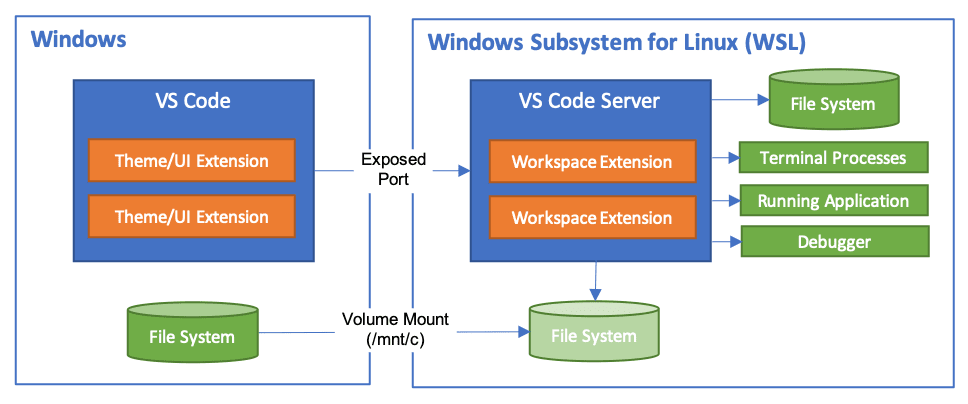
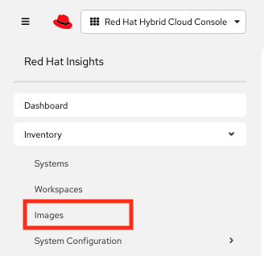

## Introduction

This blog explains how you can create your own WSL image based on Red Hat
Enterprise Linux, and why you would want to use WSL in the first place. 

<!-- I will also share the Github repository that holds the Ansible code to generate a custom RHEL WSL image in an automated way. -->

## What is WSL?

The Windows Subsystem for Linux (which could be considered to be a Linux
subsystem for Windows) is a Windows feature which allows you to run a Linux
distribution within your Windows setup. It uses a Microsoft-provided Linux
kernel and tight integration with the Windows host operating system. Microsoft
offers several distribution via its Marketplace, but Red Hat Enterprise Linux
is not one of them.

You can start your Linux distro from the Windows command line (cmd or
powershell) by typing `wsl --distribution <DistroName>`. Next you'll end up in
the login shell of your Distro. WSL has created a NAT interface for you so your
Linux distro has network connectivity to the outside world. All Windows drives
are mounted as /mnt/<DriveLetter>.

Why would you need such a WSL? Suppose you are writing ansible playbooks. You
can use VS Code, as it has nice code editing features and an ansible and yaml
extension. However in order to use the ansible-lint integration, you need to be
able to run ansible - but it's not possible to run ansible on Windows. Now VS
Code has WSL integration built in via a "remote development" extension, allowing
you to edit your code inside the WSL image and thus providing access to any tool
present in the WSL image, like ansible-lint etc.

So write your ansible code inside your WSL image using the Remote::WSL
extension, save the file and see ansible-lint directly verify your file in the
VS Code editor window! And if you would want to run the code with
ansible-navigator, you could even use the same Execution Environment in this WSL
that is meant to be used in your Ansible Automation Platform setup.

## What about the RHEL WSL?

As said, Microsoft offers several WSL images via its Marketplace, but not RHEL.
If you would want to have a RHEL WSL, you were quite on your own with maybe a
bit of help from Google. But not anymore: at Red Hat Summit 2025 it's officially
announced that you can create WSL images for RHEL 8, 9 and 10 using Red Hat's
image builder tool. The downside: there's still no RHEL image in the Microsoft
Marketplace (but there is now a Fedora 42 image available). However using the
image builder you can really tweak the image to suit your needs. Obviously, as
it is RHEL, you will need a RHEL subscription in order to use the RHEL WSL
image. A developer subscription (free to use, valid for 1 year, available from
[Red Hat](https://developers.redhat.com)) will work just fine.

Red Hat Image Builder is available through the Red Hat Hybrid Cloud Console
[Red Hat customer portal](https://console.redhat.com), in the Red hat Enterprise
Linux section ("Insights for RHEL"). Start the image builder by selecting
Inventory, Images: .

In order to create images with Image Builder, you need to define the blueprint
for the image. In this blueprint you specify which RHEL version (8, 9 or 10)
and which architecture (x86_64 or aarch64) should be used for the image, and
you define the target environment, which can be public cloud (e.g. AWS or
Azure), some form of virtualization or ... Windows Subsystem for Linux (WSL).

> At the time of writing, RHEL-10 has just been released and Ansible Automation
> Platform is not yet available on RHEL-10. So if you want to build a WSL for
> Ansible development, use RHEL-9 for now.

In the optional steps of the image creation, you can insert one of your own
activation keys so the WSL is automatically registered at Red Hat (Image Builder
will attach it to your organization). You can further tweak the WSL image
blueprint to your liking, but leave the OpenSCAP and Filesystem configuration
on its defaults. When all configuration is done, the blueprint can be saved and
the WSL image can be created. The result is a tarball (.tar.gz) which is ready
for download for a limited period of time.

## Creating the WSL

Once the WSL image is created, it's time to create the actual WSL instance on
your Windows host.