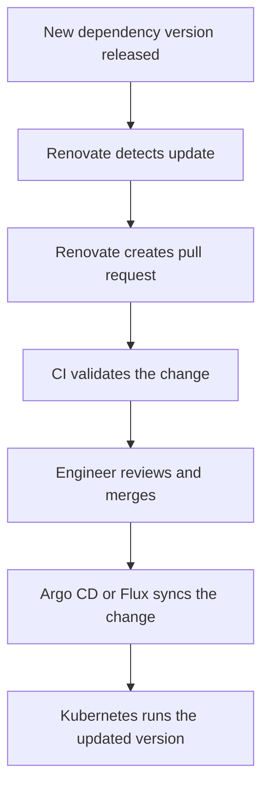
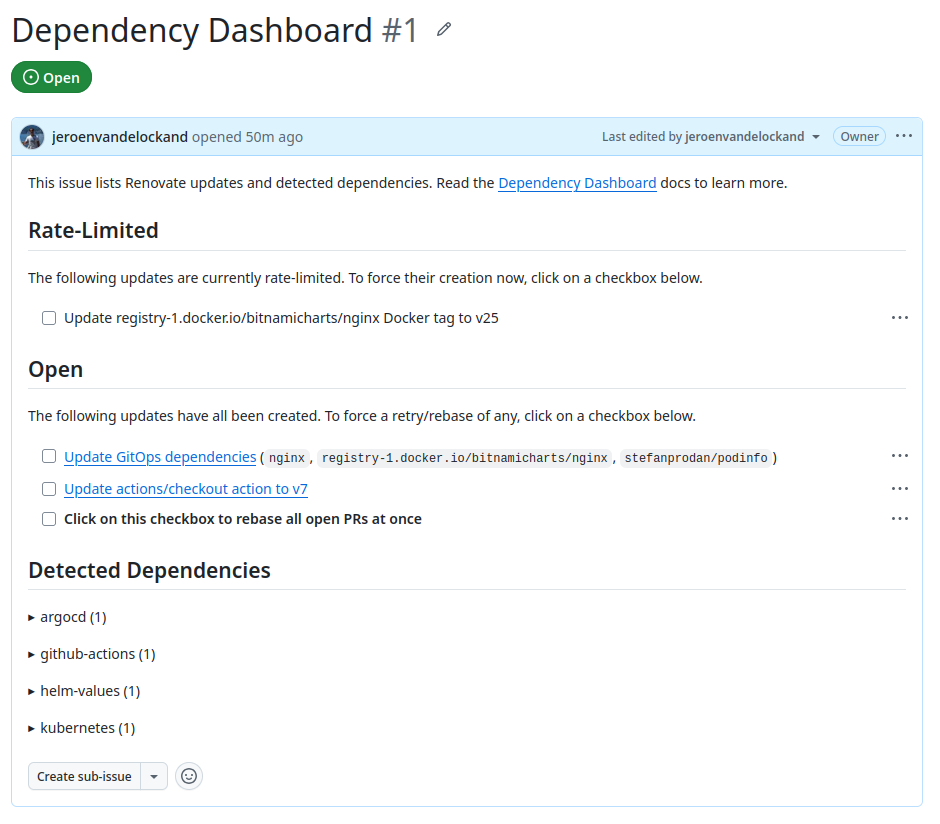
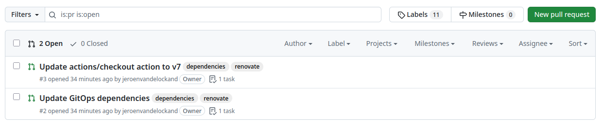

## Introduction

GitOps has become a common way of managing Kubernetes environments.

The idea is simple: Git is the source of truth.
The desired state of the platform is stored in a repository,
and tools like Argo CD or Flux continuously reconcile that
desired state to the cluster.

This gives teams a controlled and auditable deployment model.
Every change goes through Git. Every change can be reviewed.
Every change can be traced.

But GitOps does not automatically solve dependency management.

Container images still become outdated. Helm charts still release new versions.
GitHub Actions still need updates. Terraform providers and modules still move forward.
Security fixes still need to be applied.

Without automation, someone still needs to manually check all these versions.

That is where Renovate fits in.

Renovate scans repositories for dependencies and creates pull
requests when updates are available. In a GitOps environment this works
especially well, because updates are proposed as normal Git changes.
The team can review the pull request, CI can validate it,
and after merge the GitOps controller can deploy the new desired state.

## Why dependency updates are hard at scale

For a single application, manually updating dependencies
might not feel like a big problem.

But platform teams usually do not manage one application.
They manage multiple repositories, multiple environments,
multiple clusters and multiple teams.

That means dependency management quickly becomes operational work.

Think about questions like:

* Which container images are outdated?
* Which Helm charts need to be updated?
* Which updates contain security fixes?
* Which major updates need extra attention?
* Which repositories are using old GitHub Actions?
* Which teams are falling behind on maintenance?

The challenge is not just updating a version number.

The challenge is doing it consistently, safely and repeatedly
across many repositories.

Renovate helps by turning dependency updates into a
standard pull request workflow.

## The GitOps update flow

A typical GitOps workflow with Renovate looks like this:



This creates a clean separation of responsibilities.

Renovate proposes the change.
CI validates the change.
The team reviews the change.
GitOps deploys the change.

That makes dependency updates visible and auditable.

## Demo repository

To make this practical, I created a small demo repository:

https://github.com/jeroenvandelockand/renovate-gitops

The goal of the demo is to show Renovate updating different types
of GitOps dependencies:

* a container image in a Kubernetes manifest
* an image tag in a Helm `values.yaml` file
* a Helm chart version in an Argo CD `Application`
* a GitHub Action version in a workflow

The repository contains a small GitOps style structure:

```text
renovate.json
.github/
  workflows/
    renovate.yml
gitops/
  argocd/
    nginx-application.yaml
  k8s/
    deployment.yaml
  helm/
    podinfo/
      values.yaml
```

The example is intentionally small. The point is not to deploy a
production application. The point is to make the Renovate workflow
visible and easy to understand.

## Renovate configuration

The Renovate configuration lives in the root of the repository.

```json
{
  "$schema": "https://docs.renovatebot.com/renovate-schema.json",
  "extends": [
    "config:recommended",
    ":dependencyDashboard"
  ],
  "labels": [
    "dependencies",
    "renovate"
  ],
  "argocd": {
    "managerFilePatterns": [
      "/^gitops/argocd/.+\\.ya?ml$/"
    ]
  },
  "kubernetes": {
    "managerFilePatterns": [
      "/^gitops/k8s/.+\\.ya?ml$/"
    ]
  },
  "helm-values": {
    "managerFilePatterns": [
      "/^gitops/helm/.+/values\\.ya?ml$/"
    ]
  },
  "packageRules": [
    {
      "matchManagers": [
        "argocd",
        "kubernetes",
        "helm-values"
      ],
      "groupName": "GitOps dependencies"
    },
    {
      "matchUpdateTypes": [
        "major"
      ],
      "dependencyDashboardApproval": true
    }
  ]
}
```

There are a few important choices here.

First, the configuration extends `config:recommended`.
This provides a good baseline configuration.

Second, the Dependency Dashboard is enabled.
This gives a central overview of detected updates and
updates that require approval.


Third, explicit file patterns are configured
for the GitOps examples. This tells
Renovate where to look for Argo CD, Kubernetes
and Helm values files.

Fourth, GitOps related updates are grouped together.
This keeps the demo clear, because Renovate creates one pull request
for the GitOps dependency updates.

Finally, major updates require approval through the Dependency Dashboard.
This is useful because major updates often require
more review than patch or minor updates.

## Running Renovate with GitHub Actions

For the demo, Renovate is triggered manually through GitHub Actions.

```yaml
name: Renovate

on:
  workflow_dispatch:

jobs:
  renovate:
    runs-on: ubuntu-latest

    steps:
      - name: Checkout
        uses: actions/checkout@v6

      - name: Run Renovate
        uses: renovatebot/github-action@v46.1.18
        with:
          token: ${{ secrets.RENOVATE_TOKEN }}
        env:
          RENOVATE_REPOSITORIES: ${{ github.repository }}
          RENOVATE_PLATFORM: github
          LOG_LEVEL: debug
```

This makes the demo easy to run.

Instead of waiting for the hosted Renovate app schedule,
I can go to GitHub Actions and manually start the workflow.

The repository needs a GitHub token stored as an Actions secret:

```text
RENOVATE_TOKEN
```

When the workflow runs, Renovate scans the repository,
checks the dependencies and creates pull requests
when updates are available.

## Example 1: Updating a Kubernetes container image

The first example is a simple Kubernetes `Deployment`.

```yaml
apiVersion: apps/v1
kind: Deployment
metadata:
  name: renovate-demo
  namespace: renovate-demo
spec:
  replicas: 1
  selector:
    matchLabels:
      app: renovate-demo
  template:
    metadata:
      labels:
        app: renovate-demo
    spec:
      containers:
        - name: nginx
          image: nginx:1.27.0
          ports:
            - containerPort: 80
```

The dependency here is the container image:

```yaml
image: nginx:1.27.0
```

Renovate detects that the image tag is outdated and
creates a pull request to update it.

In the demo, Renovate proposed this update:

```diff
-          image: nginx:1.27.0
+          image: nginx:1.31.2
```

This is a common GitOps use case.

The desired version of the workload is stored in Git.
Renovate proposes the new version. After review and merge,
the GitOps controller can apply the change to the cluster.

## Example 2: Updating Helm values

The second example uses a Helm `values.yaml` file.

```yaml
image:
  repository: stefanprodan/podinfo
  tag: 6.6.0
```

This pattern is common when teams manage application versions
through environment specific values files.

For example:

```text
environments/
  dev/
    values.yaml
  test/
    values.yaml
  prod/
    values.yaml
```

Renovate detects the image repository and tag,
then proposes a version update.

In the demo, Renovate proposed this update:

```diff
 image:
   repository: stefanprodan/podinfo
-  tag: 6.6.0
+  tag: 6.14.0
```

This makes image updates visible through pull requests
instead of hidden manual edits.

## Example 3: Updating an Argo CD application

The third example is an Argo CD `Application` that references
a Helm chart.

```yaml
apiVersion: argoproj.io/v1alpha1
kind: Application
metadata:
  name: nginx-demo
  namespace: argocd
spec:
  project: default
  source:
    repoURL: registry-1.docker.io/bitnamicharts
    chart: nginx
    targetRevision: 15.9.0
  destination:
    server: https://kubernetes.default.svc
    namespace: nginx-demo
  syncPolicy:
    automated:
      prune: true
      selfHeal: true
```

The important field is:

```yaml
targetRevision: 15.9.0
```

Renovate detects the Helm chart version and proposes an update.

In the demo, Renovate proposed this update:

```diff
-    targetRevision: 15.9.0
+    targetRevision: 15.14.2
```

This is where Renovate and GitOps work nicely together.

The Helm chart version is updated in Git.
The pull request shows what changed.
After merge, Argo CD can sync the updated chart version to the cluster.

## Example 4: Updating GitHub Actions

Renovate can also update GitHub Actions workflows.

The demo workflow uses:

```yaml
uses: actions/checkout@v6
```

Renovate detected a newer major version and created a separate pull request:

```diff
-        uses: actions/checkout@v6
+        uses: actions/checkout@v7
```

This is useful because CI/CD workflows are also dependencies.

If the pipeline is part of the delivery platform,
it should be maintained like any other dependency.

## The Dependency Dashboard

One of the useful Renovate features is the Dependency Dashboard.

The Dependency Dashboard is created as a GitHub issue.
It gives an overview of detected updates, pending pull requests
and updates that require approval.

In this demo, the first visible result was the Dependency Dashboard issue.

At first, it looked like Renovate was only creating an
issue and no pull request.
But that was because a major update required approval.

After approving the update and running Renovate again,
Renovate created the pull requests.

This is an important lesson: the Dependency Dashboard is not an error.
It is part of the workflow, especially when approval
rules are configured.

## The result

After running Renovate, the demo repository showed two pull requests:

* `Update GitOps dependencies`
* `Update actions/checkout action to v7`



The GitOps pull request updated three files:

```text
gitops/k8s/deployment.yaml
gitops/argocd/nginx-application.yaml
gitops/helm/podinfo/values.yaml
```

The pull request contained the proposed version changes
and release information.

That is the core value of Renovate in a GitOps environment.

It turns version drift into reviewable pull requests.

## Why this matters for platform engineering

From a platform engineering perspective,
Renovate is more than a dependency update tool.

It helps create a standard operating model for dependency maintenance.

Without a standard approach, every team solves
dependency updates differently.
Some teams update frequently.
Some teams only update when something breaks.
Some teams do not know which versions they are running.

That creates risk and inconsistency.

With Renovate, the platform team can offer a paved road:

```text
Repository standards
        +
Renovate configuration
        +
Pull request workflow
        +
CI validation
        +
GitOps deployment
        =
Controlled continuous updates
```

This reduces manual work and makes updates visible.

It also helps teams avoid large upgrade moments
where months of dependency
changes need to be handled at once.

Small, continuous updates are easier to review than large,
delayed upgrades.

## Conclusion

Dependency management is one of those tasks that is
easy to underestimate.

In Kubernetes and GitOps environments, dependencies are everywhere:

* container images
* Helm charts
* Argo CD applications
* GitHub Actions
* Terraform modules
* application packages

Renovate helps by making these updates visible and manageable.

Instead of manually checking versions, teams receive pull requests.
Instead of large upgrade projects, teams review smaller changes continuously.
Instead of hidden version drift, teams get an auditable workflow.

For small teams, Renovate saves time.
For platform teams, it creates consistency.
For security teams, it improves response time.
For operations teams, it reduces risky upgrade moments.

That makes Renovate a strong addition to a
modern GitOps and platform engineering workflow.

The demo repository is available here:

[https://github.com/jeroenvandelockand/renovate-gitops/](https://github.com/jeroenvandelockand/renovate-gitops/)

If you want to engage with us regarding your platform automation challenges,
please reach out to Iliass Laghmouchi or Mark Dudock, our account
managers at [Conclusion Xforce](https://www.conclusionxforce.nl/).
