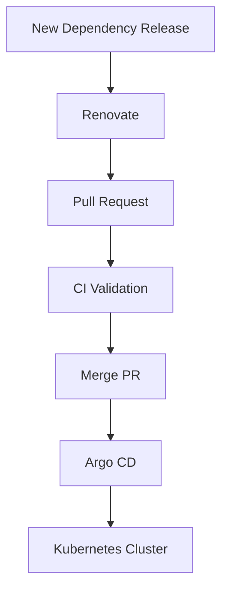

## Introduction

GitOps has become the preferred deployment model for Kubernetes platforms. Tools such as Argo CD and Flux continuously synchronize cluster state from Git repositories.

While GitOps simplifies deployments, it does not solve dependency management. Container images, Helm charts, Terraform modules, and GitHub Actions still require regular updates.

This is where Renovate shines.

Consider the following Helm deployment:

```yaml
spec:
  source:
    chart: nginx
    targetRevision: 15.2.1
```

When a new chart version becomes available, Renovate automatically creates a pull request updating the version:

```yaml
spec:
  source:
    chart: nginx
    targetRevision: 15.3.0
```

After the pull request is reviewed and merged, Argo CD or Flux automatically deploys the change to the cluster.

The complete workflow becomes:



This creates a fully automated and auditable update process.

## Updating Container Images

Renovate can monitor container images defined in Kubernetes manifests:

```yaml
image: quay.io/keycloak/keycloak:26.2.0
```

When a newer version is released, Renovate opens a pull request with the updated tag.

This approach ensures clusters remain current without manually tracking image releases.

### Updating GitHub Actions

Many repositories contain outdated CI/CD actions.

Example:

```yaml
uses: actions/checkout@v4
```

Renovate automatically detects newer versions and submits pull requests, helping maintain secure and supported CI pipelines.

## Updating Terraform Modules

Infrastructure-as-Code repositories also benefit from Renovate:

```terraform
module "aks" {
  source  = "Azure/aks/azurerm"
  version = "8.0.0"
}
```

Renovate monitors module releases and proposes upgrades through pull requests, keeping infrastructure components current.

## Enterprise Benefits

Teams operating multiple repositories often face challenges such as:

- Inconsistent dependency versions
- Delayed security updates
- Upgrade projects that consume entire sprints
- Lack of visibility into outdated software

Renovate addresses these issues by making updates continuous rather than periodic.

Instead of upgrading six months of accumulated technical debt, teams review small incremental changes every week.

## Example

Imagine a platform team managing:

- 50 Kubernetes repositories
- 200 Container images
- 75 Helm charts
- 40 Terraform modules
- 20 GitHub Actions workflows

Without Renovate, tracking updates becomes a significant operational burden.

With Renovate:

- New versions are detected automatically
- Pull requests are generated consistently
- Security fixes arrive faster
- Teams spend less time on maintenance and more time delivering features

This makes Renovate an essential component of a modern platform engineering toolkit.

If you want to engage with us regarding your platform automation challenges, please reach out to Iliass Laghmouchi or Mark Dudock, our account managers at [Conclusion Xforce](https://www.conclusionxforce.nl/).
