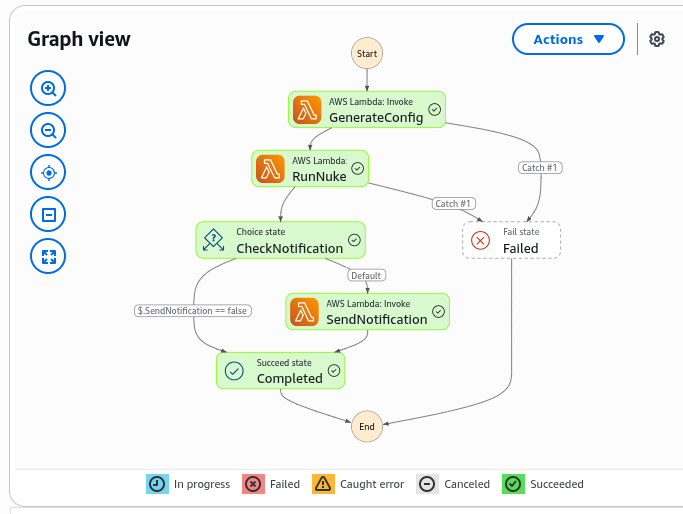

A client of mine was updating all Python runtime versions to the newest
version. They also created their own cleanup Lambda functions for development
resources. This just contained a specific set of AWS resource types. I
advised them to use AWS Nuke, as this can cleanup way more AWS resources. I
volunteered to create a generic solution for this, that also tries to get
the newest aws-nuke version when it is released. You can find that solution
[in this github repository](https://github.com/FrederiqueRetsema/aws-nuke-with-aws-stepfunctions)

## Installation

I tried to keep the installation as simple as possible: it's just a matter of
copying a template file with environment variables to your own version of
it, then change the variables in the way you want to use the tool and go.
Some settings that you can use are:

### Schedule

#### Manual

No administrator will use a tool like aws-nuke without first wanting to
see what resources will be deleted. You can use the manual mode for this:
set the SCHEDULE variable to `manual`, configure the rest of the `setenv.sh`
file and then start the deployment with `bash ./scripts/deploy-cdk.sh`.
When the deployment is ready, you can start the execution of the dry run via
`./scripts/start-manual-workflow.sh`. When the run is ready you will
receive an email, you can then decide to tag some resources that you want to
keep or to go ahead and remove the resources in the list. This can be done
using the `./scripts/approve-execution.sh` script. After the removal of the
resources you will get an email with the link to the output of aws-nuke.

#### Cron expression

You can also add a cron expression, for example `cron(0 4 ? * WED *)` to run
every Wednesday at 4:00 in the morning. After the deployment with
`bash ./scripts/deploy-cdk.sh`, the tool will start on the specified moment.
You can use the
[AWS Cron Expression Validator & Generator](https://awscronexpression.org/)
to create valid AWS cron expressions if you need to.

You will not get an email for these executions (the aws-nuke logs are stored
in the S3 bucket). It will also directly remove the resources, without doing
a dry run first.

When you want to do a manual cleanup in between, you can still use the
`start-manual-workflow.sh` and `approve-execution.sh` scripts. These
scripts will still send you emails.

### Blocklist accounts

AWS Nuke will never run in blocklist accounts. It might be useful to fill
in the number(s) of your production account(s) here.

### Nuke version and enforce version

Some people (like me) like tools like this to always use the most recent
version of aws-nuke. In that case, you can fill in the most recent version
number from the
[aws-nuke releases](https://github.com/ekristen/aws-nuke/releases) page in
NUKE_VERSION and keep the ENFORCE_VERSION on `false`. The tool will then try
to get the most recent version and, if it doesn't succeed in determining
which version that is, fall back to the version number in NUKE_VERSION.

When you, on the other hand, always want to use a specific version from
aws-nuke because you have an extended test process in place outside this
tool, you can put the version number that you want to use in the
NUKE_VERSION variable and put the ENFORCE_VERSION on `true`.

## Architecture

My CDK script is based on an AWS Step Function to first create a configuration
script for AWS Nuke and then start the execution.



The first Lambda function will create the config file, then the second Lambda
function starts AWS Nuke. This is either in dry-run mode or in execution
mode - the difference is based on the parameters of the workflow. Another
parameter is used to check if a notification should be sent.

The configuration file and the output are stored in an S3 bucket, a lifecycle
policy on this bucket will remove the files after 30 days (which is
configurable). The scheduling is done by EventBridge rules. SNS will send the
email. From an AWS perspective this solution is pretty straightforward.

## Config file

The configfile will keep certain resources alone:

* Of course, the resources that are tagged with the key/value pair that we
provided
* Resources related to AWS Control Tower
* Resources related to the CDK Toolkit
* Resources related to our project

When I initially ran aws-nuke, I saw a lot of AWS errors from resources that
didn't exist anymore. I included all these resource types in the exclusion
list.

The configfile for aws-nuke that is created based by the Lambda function
looks like:

```yaml
blocklist:
- '123456789012'
regions:
- eu-west-1
- eu-central-1
resource-types:
  excludes:
  # Network interfaces and attachments (removed with parent resources)
  - EC2NetworkInterface
  - EC2DHCPOption
  - EC2InternetGatewayAttachment

  # Bedrock issues
  - BedrockModelCustomizationJob

  # Deprecated/unused resource types
  - CloudSearchDomain
  - CodeStarProject
  - ElasticTranscoder*
  - FMSNotificationChannel
  - FMSPolicy
  - OpsWorks*
  - QLDBLedger
  - Lex*
  - MachineLearning*
  - RoboMaker*
  - ShieldProtection*
  - AWS::Timestream::*
accounts:
  999999999999:
    filters:
      __global__:
      - property: tag:Cleanup
        value: persist
      - property: tag:aws:cloudformation:stack-name
        value: CDKToolkit
      - property: tag:aws:cloudformation:stack-name
        type: glob
        value: StackSet-AWSControlTowerBP-*
      - property: Name
        type: glob
        value: aws-controltower-*
      - property: Name
        type: glob
        value: AWSControlTower*
      - property: Name
        type: glob
        value: aws-nuke*
      CloudFormationStack:
      - property: Name
        type: glob
        value: StackSet-AWSControlTowerBP-*
      CloudWatchLogsLogGroup:
      - property: Name
        type: glob
        value: /aws/lambda/aws-nuke-*
      - property: Name
        type: glob
        value: /aws/lambda/aws-controltower-*
      S3Object:
      - property: Bucket
        value: aws-nuke-aws-nuke-bucket-999999999999
      - property: Bucket
        type: glob
        value: cdk-hnb659fds-*
      SNSSubscription:
      - property: TopicARN
        type: glob
        value: arn:aws:sns:*:999999999999:aws-nuke-*
      - property: TopicARN
        type: glob
        value: arn:aws:sns:*:999999999999:aws-controltower-*
      SNSTopic:
      - property: TopicARN
        type: glob
        value: arn:aws:sns:*:999999999999:aws-controltower-*
```

## Warning on volumes of EC2 instances

Tag based protection works fine when everything that should be protected is
tagged correctly. In general tags that are applied to a CloudFormation stack
are also applied on the resources that are created by the stack. This is
also true for EC2 instances, but volumes that are created by the EC2 instances
are not tagged by default. You can do that by adding the
`PropagateTagsToVolumeOnCreation: true` property to the EC2 instance.

When you don't add this tag to the volume, no tags will be attached to the
volume and aws-nuke will try to remove the volume. But because it is
attached to the EC2 instance, the volume cannot be removed. After a few times
aws-nuke will stop trying to remove the volume. Though the EC2 instance will
run like before, these retries cost time. And because Lambda functions are
billed based on time this will also cost some money.

## Kiro

I created this solution with Kiro, which saved me about 50% of the time. Of
course I checked all the code before releasing it via my github repository.

There are advantages and disadvantages on using Kiro. I didn't like it that
Kiros code sometimes didn't work, even though Kiro in general needs less
tries between the first try and the working project as I would need.

Kiros initial idea was to create a step function that would first start
a dry run of aws-nuke and then wait for manual approval. More or less like
this
[simplified example](https://docs.aws.amazon.com/step-functions/latest/dg/tutorial-human-approval.html#human-approval-yaml)
. It tried at least 15 times before giving up and choosing the current
solution, where the same workflow is started for both the dry run and the
final execution. In the end, I didn't bother: the solution works and most
people will use the scheduled variant more than the manual way of working
anyway.

Kiros solution also costs me more than one day to clean up all the
documentation files, extra checks and the extra configuration that Kiro added -
just because it wasn't sure what keywords to use. It put simply two different
keywords with the same configuration in the configuration file.

In some cases, Kiro put all the code in one Lambda function. Some code
was put there multiple times, rewriting this code improved the readability.

There was also a bug in `fsWrite`, which is Kiros way of writing files to the
operating system (in my case Fedora). Kiro saw the content of the files,
where the content wasn't visible from the operating system. This lead to
a lot of errors in cdk runs that were not necessary. It was simple to solve:
you can create the file `.kiro/agents/default.json` and put the following
content in it:

```json
{
  "description": "Default agent with fs_write workaround",
  "allowedTools": [
    "fs_read",
    "execute_bash"
  ],
  "toolsSettings": {
    "execute_bash": {
      "autoAllowReadonly": true
    }
  },
  "instructions": "For file creation and modification, always use
  execute_bash with shell commands like 'cat > file << EOF' or
  'echo content > file' instead of fs_write tool due to zero-byte
  file issues."
}
```

Kiro was able to give me this solution - I just had to ask for it...

## Image

Image by
[Reginaldo Martins]("https://pixabay.com/users/rmartins759-2206007/?utm_source=link-attribution&utm_medium=referral&utm_campaign=image&utm_content=1450615")
from
[Pixabay]("https://pixabay.com//?utm_source=link-attribution&utm_medium=referral&utm_campaign=image&utm_content=1450615")
