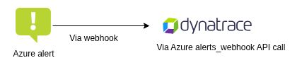
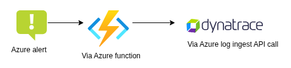
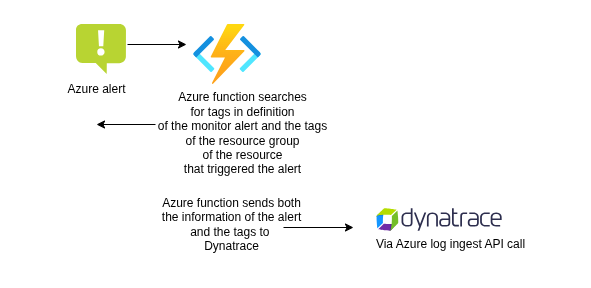

## Introduction

Not too long ago, we were asked to send Azure Monitor Alerts to Dynatrace.
It didn't seem too difficult, there even was a page in the Dynatrace
documentation how to do this [1]. When we followed this document, the
result was somewhat disappointing: monitor alerts were sent to Dynatrace,
but the events that were created didn't contain many properties:

```json
{
  "records": [
    {
      "timestamp": "2025-08-15T10:24:47.351000000+02:00",
      "event.id": "1234567890123456789_0123456789012",
      "event.status": "CLOSED",
      "dt.davis.timeout": "15",
      "source": "Azure activity log - Administrative",
      "affected_entity_types": [
        "dt.entity.custom_device"
      ],
      "event.provider": "ONEAGENT",
      "event.category": "INFO",
      "affected_entity_ids": [
        "CUSTOM_DEVICE-D1234A56B78C9012"
      ],
      "dt.davis.mute.status": "NOT_MUTED",
      "event.status_transition": "CREATED",
      "annotation_type": "Informational",
      "dt.entity.custom_device": "CUSTOM_DEVICE-D1234A56B78C9012",
      "event.group_label": "Custom annotation",
      "dt.source_entity": "CUSTOM_DEVICE-D1234A56B78C9012",
      "maintenance.is_under_maintenance": false,
      "dt.source_entity.type": "custom_device",
      "dt.openpipeline.source": "oneagent",
      "event.name": "Annotation",
      "event.kind": "DAVIS_EVENT",
      "event.start": "2025-08-15T10:17:22.075000000+02:00",
      "dt.davis.is_frequent_event": false,
      "event.description": "Microsoft.DBforMySQL/flexibleServers/write: Started (Informational)",
      "event.end": "2025-08-15T10:39:47.349000000+02:00",
      "dt.davis.impact_level": "Infrastructure",
      "event.type": "CUSTOM_ANNOTATION"
    }
  ]
}
```

The name of the alert rule wasn't present, there was no name of the resource or
the resource group. When I tried to get the custom device name via
`entityName(dt.entity.custom_device)`, it came back with null. Our Azure
environment has hundreds of alerts, how can one make the difference between
them and how to decide when a problem should be created - and when not to do so?
We couldn't use this event to determine the name of the application.

The question was then: was this Dynatrace not showing enough data, or is it
Azure not sending the data to Dynatrace? My colleague pointed to the nice
(free!) website where one can test webhooks:
[https://beeceptor.com](https://beeceptor.com). Via this website we got the
complete text that is sent to Dynatrace by the webhook in Azure Monitor Alerts:

```json
 {
    "schemaId":"Microsoft.Insights/activityLogs",
    "data":{
        "status":"Activated",
        "context":{
            "activityLog":{
                "authorization":{
                    "action":"Microsoft.DBforMySQL/flexibleServers/write",
                    "scope":"/subscriptions/123a45b6-78c9-0d12-e3f4-567gh8901ij1/resourceGroups/my-resourcegroup/providers/Microsoft.DBforMySQL/flexibleServers/my-database"
                },
                "channels":"Operation",
                "claims":"{...}",
                "caller":"frederique.retsema@conclusionxforce.nl",
                "correlationId":"1ab2345c-d678-901e-234f-5678gh90123i",
                "description":"",
                "eventSource":"Administrative",
                "eventTimestamp":"2025-08-13T10:56:14.2468371+00:00",
                "httpRequest":"",
                "eventDataId":"a123b456-c78d-9012-3456-ef7gh8ij90kl",
                "level":"Informational",
                "operationName":"Microsoft.DBforMySQL/flexibleServers/write",
                "operationId":"a12b3456-c7d8-90e1-fg23-45hijkl6789m",
                "properties":{
                    "eventCategory":"Administrative",
                    "entity":"/subscriptions/123a45b6-78c9-0d12-e3f4-567gh8901ij2/resourcegroups/my-resourcegroup/providers/Microsoft.DBforMySQL/flexibleServers/my-database",
                    "message":"Microsoft.DBforMySQL/flexibleServers/write",
                    "hierarchy":"12345ab6-cdef-78gh-i9jk-0123l4m56789/123a45b6-78c9-0d12-e3f4-567gh8901ij2"
                },
                "resourceId":"/subscriptions/123a45b6-78c9-0d12-e3f4-567gh8901ij2/resourcegroups/my-resourcegroup/providers/Microsoft.DBforMySQL/flexibleServers/my-database",
                "resourceGroupName":"my-resourcegroup",
                "resourceProviderName":"Microsoft.DBforMySQL",
                "status":"Succeeded",
                "subStatus":"",
                "subscriptionId":"123a45b6-78c9-0d12-e3f4-567gh8901ij2",
                "tenantId":"12345ab6-cdef-78gh-i9jk-0123l4m56789",
                "submissionTimestamp":"2025-08-13T10:58:59+00:00",
                "ReceivedTime":"2025-08-13T10:58:59.3078161+00:00",
                "ingestionTime":"2025-08-13T10:59:02.8559575+00:00",
                "resourceType":"Microsoft.DBforMySQL/flexibleServers"
            }
        },
        "properties":{}
    }
}
```

This contains more properties: when we would have this in Dynatrace, we could
check on the resource, the resource group, maybe even the tenant ID to base our
decisions on. We still wouldn't have the name of the alert, though. Or the tags
of the alert rule. To have the name of the alert and the tags as well would make
our lives easier, because that makes troubleshooting a lot easier: we could then
connect a problem in Dynatrace to an alert in Azure. So how would we get this?

## Different route

So, the original route goes from the Azure Monitor Alert Rule, via an Action
Group to the dedicated Azure Web Hook within ActiveGate in Dynatrace
(`https://<YOUR_ACTIVEGATE_ADDRESS>:9999/modules/azure_monitoring/alerts_webhook?token=<YOUR_API_TOKEN>`).



When we add an Azure Function in between and then let the Azure Function use
the Dynatrace log ingest API, we are free to put any properties we want in the
call.



This works (see the repository with Terraform code here: [2]), now we have all
the information we need, including the name of the alert rule:

```DQL
fetch logs
| filter log.source == "Azure Monitoring Alert"
| sort timestamp desc
| limit 1
```

This leads to f.e. the following inserted log item:

```json
    {
      "timestamp": "2025-08-15T18:44:45.896000000+02:00",
      "content": "...",
      "event.type": "LOG",
      "log.source": "Azure Monitoring Alert",
      "loglevel": "DEBUG",
      "status": "INFO",
      "data.alertcontext.activity log event description": "",
      "data.alertcontext.authorization.action": "Microsoft.DBforMySQL/flexibleServers/write",
      "data.alertcontext.authorization.scope": "/subscriptions/123a45b6-78c9-0d12-e3f4-567gh8901ij2/resourceGroups/my-resourcegroup/providers/Microsoft.DBforMySQL/flexibleServers/my-database",
      "data.alertcontext.caller": "frederique.retsema@conclusionxforce.nl",
      "data.alertcontext.channels": "Operation",
      "data.alertcontext.claims": "{...}",
      "data.alertcontext.correlationid": "12345678-9a0b-1cd2-e34f-5g678901g234",
      "data.alertcontext.eventdataid": "a123bc4d-e5f6-789g-0h12-345i678j9012",
      "data.alertcontext.eventsource": "Administrative",
      "data.alertcontext.eventtimestamp": "2025-08-15T16:40:01.8435309+00:00",
      "data.alertcontext.httprequest": "",
      "data.alertcontext.ingestiontime": "2025-08-15T16:42:46.8093833+00:00",
      "data.alertcontext.level": "Informational",
      "data.alertcontext.operationid": "ab1c2345-6d78-90ef-1g2h-34ij567k8lm9",
      "data.alertcontext.operationname": "Microsoft.DBforMySQL/flexibleServers/write",
      "data.alertcontext.properties.entity": "/subscriptions/123a45b6-78c9-0d12-e3f4-567gh8901ij2/resourcegroups/my-resourcegroup/providers/Microsoft.DBforMySQL/flexibleServers/my-database",
      "data.alertcontext.properties.eventcategory": "Administrative",
      "data.alertcontext.properties.hierarchy": "12345ab6-cdef-78gh-i9jk-0123l4m56789/123a45b6-78c9-0d12-e3f4-567gh8901ij2",
      "data.alertcontext.properties.message": "Microsoft.DBforMySQL/flexibleServers/write",
      "data.alertcontext.receivedtime": "2025-08-15T16:42:44.7210637+00:00",
      "data.alertcontext.status": "Succeeded",
      "data.alertcontext.submissiontimestamp": "2025-08-15T16:42:44+00:00",
      "data.alertcontext.substatus": "",
      "data.alertcontext.tenantid": "12345ab6-cdef-78gh-i9jk-0123l4m56789",
      "data.essentials.alertcontextversion": "1.0",
      "data.essentials.alertid": "/subscriptions/123a45b6-78c9-0d12-e3f4-567gh8901ij2/providers/Microsoft.AlertsManagement/alerts/1a2345b1-6cd7-8e90-1f2g-3h4i5678j901",
      "data.essentials.alertrule": "Alert for creation of database",
      "data.essentials.alertruleid": "/subscriptions/123a45b6-78c9-0d12-e3f4-567gh8901ij2/resourceGroups/my-resourcegroup/providers/microsoft.insights/activityLogAlerts/Alert for creation of database",
      "data.essentials.alerttargetids": [
        "/subscriptions/123a45b6-78c9-0d12-e3f4-567gh8901ij2/resourcegroups/my-resourcegroup/providers/microsoft.dbformysql/flexibleservers/my-database"
      ],
      "data.essentials.configurationitems": [
        "my-database"
      ],
      "data.essentials.description": "Testing Dynatrace",
      "data.essentials.essentialsversion": "1.0",
      "data.essentials.fireddatetime": "2025-08-15T16:44:45.8960322Z",
      "data.essentials.investigationlink": "https://portal.azure.com/#view/Microsoft_Azure_Monitoring_Alerts/Issue.ReactView/alertId/%2fsubscriptions%123a45b6-78c9-0d12-e3f4-567gh8901ij2%2fresourceGroups%2fmy-resourcegroup%2fproviders%2fMicrosoft.AlertsManagement%2falerts%2f1a2345b1-6cd7-8e90-1f2g-3h4i5678j901",
      "data.essentials.monitorcondition": "Fired",
      "data.essentials.monitoringservice": "Activity Log - Administrative",
      "data.essentials.originalertid": "a123bc4d-e5f6-789g-0h67-890i123j4567_8k9l012m3456n7o89pqr0st123uvw45x",
      "data.essentials.severity": "Sev4",
      "data.essentials.signaltype": "Activity Log",
      "data.essentials.targetresourcegroup": "my-resourcegroup",
      "data.essentials.targetresourcetype": "microsoft.dbformysql/flexibleservers",
      "dt.auth.origin": "dt0x01.ABCDEFG12H3IJKLMNOPQRSTU",
      "dt.openpipeline.pipelines": [
        "logs:default"
      ],
      "dt.openpipeline.source": "/api/v2/logs/ingest",
      "schemaid": "azureMonitorCommonAlertSchema"
    }
```

By making it a log line instead of an event, it is possible to use OpenPipeline
to create metrics and Events/Buziness Events out of this - as we can determine
in the future. The metrics can then be used in Davis Anomaly Detectors, which
can also use the severity in the log line.

## Adding tags

Both the original webhook calls that are sent to Dynatrace and the calls to
Azure Function don't send the tags of the monitor alert to Dynatrace. This is a
pitty, because the tags can be used to add the application name, or the business
unit name, or the security rating of the system to Dynatrace. You don't want to
maintain this kind of information in multiple places. Therefore, the solution
should be changed a little bit:



Now, the lines with tags in the log line become for example:

```json
{
    ...
      "alert.tag.goal": "Test Dynatrace",
      "alert.tag.name": "Frederique",
      "alert.tag.tagwithspaces": "Spacy",
      "resourcegroup.tag.goal": "ResourceGroup Test Dynatrace"
    ...
}
```

As you can see here, spaces in the original tag are removed (the original tag
key was `Tag with spaces`)

## Security

To allow the Azure Function to read the Alert Rules, a managed identity is
created. The Dynatrace URL and the Dynatrace token are both stored in an Azure
Key Vault.

## Reusable

This solution is very generic. Use it in any environment you like.

## Installation

You can find the Terraform code in my repository [2]. First, copy the file
`setenv.template.sh` to `setenv.sh` and change the content. Likewise, copy the
file `terraform.auto.template.tfvars` to `terraform.auto.tfvars` and change
the contents.

Then, use the following commands to deploy this solution to your environment:

```bash
. ./setup.sh
. ./login.sh
. ./deploy.sh
```

If you ever want to remove the resources from your environment, use the
following commands to do so:

```bash
. ./setup.sh
. ./remove.sh
```

## Permissions

When you look in the main.tf terraform file, it might seem double to both assign
"Monitoring Reader" and "Reader" permissions. When you don't mind to give reader
permissions to the Azure Function, then remove the "Monitoring Reader" permissions.
When you do mind, then remove the "Reader" permissions. When you only give
"Monitoring Reader" permissions, the Azure Function will not send back tags of the
resource group of the resource that triggert the alert rule.

## Testing

You can use the test script to send a record with the most basic information to
the Azure Function. The steps are:

1) Copy the `testfunction.template.sh` file to `testfunction.sh`
2) Copy the default key from the Azure Function App (open the function app, left
   menu, Functions > App keys > default) and paste it in `testfunction.sh`
   (in the ?code=... part of the URL)
3) Change the other variables in this script as well

The curl will result in a 204 errorcode when the call is successful. You can also
look in the invocation tab of the Azure Function.

## Configuration

Now the Azure Function works, you can add the Azure Function to the action group
of the monitoring alert. Example:


## Links

[1] Dynatrace documentation how to send Azure Monitor Alerts to Dynatrace:
[see here](https://docs.dynatrace.com/docs/ingest-from/microsoft-azure-services/azure-integrations/azure-monitoring-guide/set-up-monitoring-with-azure-alerts)
[2] Repo with Terraform code: [https://github.com/FrederiqueRetsema/azure-alerts-dynatrace](https://github.com/FrederiqueRetsema/azure-alerts-dynatrace)
