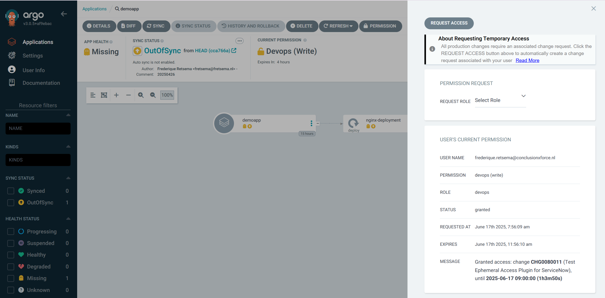

## Introduction

In my last blog, I already mentioned the ArgoCD Ephemeral Access Extension
briefly. I was very excited about it when I learned from it on Kubecon: I
think it is a valuable tool to increase the security of a Kubernetes production
cluster. The authors of the Ephemeral Access Controller wrote the GUI, it
was/is up to the community to write plugins for several tools. It is the role
of the GUI to allow the user to request permissions, the role of the plugin is
to grant or deny the request. In this way, the same Access Extension can deal
with different reasons to allow or deny the request. I wrote the plugin for
ServiceNow, you can find it on my Github repository [1]. Information how to
install and configure the plugin is in that repository as well. In this blog I
will describe the plugin from an operator point of view.

## How does it work?

When the user requests more access, the Ephemeral Access Extension will call
the plugin to do the checks. The plugin should be written in go. The request
comes in on the GrantAccess method, which will do the tests. When all tests
pass, then the plugin can return plugin.GrantStatusGranted in the status field,
to indicate that the request is granted. Likewise, plugin.GrantStatusDenied can
be returned when the request is denied. When the plugin needs more time, then
plugin.GrantStatusPending can be returned, the Ephemeral Access Extension will
then call on GrantAccess later again to see if a new status is available. My
plugin only returns GrantStatusGranted or GrantStatusDenied, to keep it simple.

When you want to get a deep dive of the Ephemeral Access Extension itself, you
can read the information on the Github repository [2].

### Checks on the Change Item

When the plugin is called, it will first look in the lables of the ArgoCD
application which Configuration Item (CI) in the CMDB belongs to this
application. In this example, I will use the default ciName as label key
and app-demoapp as name of the CI.


The plugin will call the API of ServiceNow and get the information of the CI.
Based on that, it decides if the CI is valid. There are multiple values in
ServiceNow for a CI. The plugin will allow a request for a CI that has one of
the following statuses:

```ServiceNow
1 = Installed
3 = In maintenance
4 = Pending install
5 = Pending repair
```

When the status is different, then the request is denied. It doesn't make sense
to change an application that has a state of Absent, Retired or Stolen.

The username and password for the ServiceNow API are stored in a secret in
Kubernetes, the URL of the ServiceNow API is stored in environment variables of
the `controller` deployment in the `argocd-ephemeral-access` namespace.

### Checks on the changes

When the CI is valid, then the changes are retrieved. It is currently not
possible to add a change number to the request from ArgoCD, this means that
we have to get all changes that might be relevant to our request. This has
two big disadvantates: when there are lots of changes, then the request to
the ServiceNow API might become very slow. There might also be multiple valid
changes, currently the plugin will take the first one that is sent by the API.
This might not be the correct one, and this might impact the amount of time
that one gets to do the change.

To limit the number of changes that are sent back by the API, most of the
checks on the change are done by the API. For example: we only want to get back
changes that are approved. The full list of checks is:

* Is the change connected to the correct and valid CI (see before)?
* Does the change have the state "Implement"?
* Does the change have the phase "Requested"?
* Is the change approved?
* Is it an "active" change?
* Does the change not start before 1 week back?
* Does the change not end after 1 week from now?

These last two checks are meant to limit the amount of changes that we get from
the API and I hope that this will speed up the calls to the API in a bigger
production environment.

### Duration of the extra permissions

Currently, the Ephemeral Access Extension passes the duration of the permission
in the Access Request to the plugin. Unfortunately there doesn't seem to be a
way to change this duration: not from the go code in the plugin, not by
changing the AccessRequest in Kubernetes. This means, that by default a request
is either granted for the full duration of the request (which is by default 4
hours), or it is denied. I think that it would be wise to change this and let
the plugin decide the duration of the permissions. From an ITIL point of view,
changes have different durations. A change can be two hours, four hours, one
day - maybe even multiple days when the change is part of a very big change
where the work will take a whole weekend.

The question is: how much time should the permission be granted? I raised this
as
[an issue](https://github.com/argoproj-labs/argocd-ephemeral-access/issues/101)
on the Ephemeral Access Extension github repository. The conclusion was that the
plugin should be able to limit the duration, but not extend the default
duration. This will be implemented in a future release of the Ephemeral Access
Extension.

Up to the moment that this change is implemented, the plugin has to work around
this issue. There is one (quite dirty) trick around this, and that is to delete
the AccessRequest in Kubernetes. The effect is that permissions are revoked on
the moment that the AccessRequest is no longer there. For the ServiceNow plugin
this means that:

* When a change has an end date that is __later__ than the duration in the
original request, then the Ephemeral Access Extension will stop the permission
after this duration,
* When a change has an end date that is __earlier__ the duration in the
original request, then a Kubernetes CronJob is created that will delete the
AccessRequest. To prevent CronJobs to be kept forever, the job that is
started by the CronJob will remove the CronJob after the AccessRequest is
deleted. Unfortunately, this means that the logs are no longer present after
this. Unfortunately there doesn't seem to be a way to start jobs only once on a
certain time. It would be nice to have such a feature (and then use
`ttlSecondsAfterFinished` in that type of Job as well to clean them up
automatically).

### Reporting back to the operator

When the AccessRequest is granted, I used Markdown language to make fields like
the change number and the end date and the duration bold. This is important
because the difference between the date and time in the message are leading,
not the time in the "Expires" field that is shown by the Ephemeral Access
Extension.


Unfortunately, the Ephemeral Access Extension doesn't give a nice message when
the request is denied. One has to search in the AccessRequests within
Kubernetes or in the logs of the plugin to find out why a request is denied.
The people who maintain the Ephemeral Access Extension will fix this in
the future by adding a history of requests, see
[this issue](https://github.com/argoproj-labs/argocd-ephemeral-access/issues/88).

When the request is granted, the ServiceNow plugin will also write a note in
the change that the request is granted. In this way, everyone who is interested
in the change can see who was granted access and for how long.


### Exclusion roles

I think that for many environments this functionality is enough to work on a
day-by-day base. There might, however, come a day where a lot goes wrong.
The day that you don't have time to create a change, keep the duration and the
statuses in ServiceNow correct etcetera. Maybe ServiceNow itself has API errors
and changes cannot be checked. For these use cases, I created "Exclusion Roles":
roles of the Ephemeral Access Controller that will not look at CIs and changes,
but will immediately grant access.


You might use this for incident managers, who coordinate an incident and add
administrators to the incidentmanager group on the moment that these issues
happen. Or you might have roles of "Senior Staff" that knows when to bypass
Service Now, and when not to do so. It shouldn't become a "normal way of
working" to use this mechanism, the plugin will give a warning when someone
gets access via an exclusion role:


when someone is granted permission based on a change, this information has INFO
severity:


You can see here that the timezone on the server is different from the timezone
in the UI. This isn't an issue. It is, however, important to use the same
timezone in the environment variables of the plugin and the timezone of the user
in the ServiceNow environment that the plugin is using.

## Changes in existing Kubernetes resources

The username and password for the ServiceNow API are stored in a secret in
Kubernetes. The ClusterRole controller-role (that is created by the Ephemeral
Access Extension) has to be changed to be able to read the secret. The
ClusterRole should also be allowed to create CronJobs.

The controller deployment has to be changed as well: I added a lot of
environment variables, some of them use defaults. The "value at deployment"
is the value that you can find in the Github repository under
`manifests > plugin > controller-patch.yaml`. When you remove the environment
variable, sometimes it will use a sensible default. For other environment
variables the plugin will deny permissions when the environment variable is not
present.

| Environment variable   | Value at deployment                         | Default value           | Remarks     |
| ---------------------- | ------------------------------------------- | ----------------------- | ----------- |
| SECRET_NAMESPACE       | argocd-ephemeral-access                     | argocd-ephemeral-access |             |
| SERVICENOW_SECRET_NAME | CHANGE_THIS_WITH_THE_SERVICENOW_SECRET_NAME | servicenow-secret       | (1) (2)     |
| SERVICENOW_URL         | CHANGE_THIS_TO_POINT_TO_YOUR_SERVICENOW_URL | n/a                     | (1) (3)     |
| EXCLUSION_ROLES        | incidentmanager                             | n/a                     | (4)         |
| TIMEZONE               | Europe/Amsterdam                            | UTC                     | (2)         |
| CI_LABEL               | ciName                                      | ciName                  |             |
| EPHEMERAL_PLUGIN_PATH  | /tmp/plugin/plugin                          | n/a                     | (5)         |

(1) Plugin will deny access when this value is not changed  
(2) When this environment variable is removed, the value under "Default value"
is used  
(3) When this environment variable is removed, the plugin will deny access  
(4) When you want to use incidentmanager as an exception role, you need to
create AccessBindings and RoleTemplates for incidentmanager as well. You can
look in the cloudformation directory for a working environment in AWS for this
configuration.  
(5) Don't change this, it is part of the Ephemeral Access Extension
configuration.

## How to create a ServiceNow development environment

One of the advantages of ServiceNow is that everyone can create a development
environment in minutes. You need to register a developer account [3] and then
you can create a ServiceNow instance, including access to all APIs. When you
don't use the ServiceNow instance for 10 days, then the instance will be
deleted.

There are two ways of configuring the development environment: via a script and
via the ServiceNow portal. To get the URL, the username and the password for
your instance, log in to the developer platform and go to your profile
(initials in the upper-right corner of the screen). Click under Instance Action
on menu item "Manage instance password":


You now have the Instance URL, that can be used both for the API and for the
portal.


### Via a script

Not all settings can be changed using a script. When you want to create a
dedicated plugin user in ServiceNow, you still have to do this via the portal.
Please mind to set the timezone of this plugin user to be the same as the
environment parameter of the plugin. It is possible to use the admin user as
the user for the plugin as well, which can be useful for testing the plugin.

I added two scripts to the repository: one to create a CI class with a CI, the
other one to add a change with the valid statuses. The scripts are in the
`/examples/servicenow-scripts` directory. Both scripts need the ServiceNow URL,
the username and the password as parameters, for example:

```bash
create-ci-class-with-ci.sh https://dev123456.service-now.com admin a%B12CdE
create-change.sh https://dev123456.service-now.com admin a%B12CdE
```

When you want to know more about the ideas behind the script, I will explain
that in the next part about the configuration via the ServiceNow portal.

### Via the ServiceNow portal

#### Change the timezone

First change the timezone in the console: click in the upper right corner on
your account (for admin users: the image of the smiling guy), then select
__Profile__. Change the Time zone (in my case: to __Europe/Amsterdam__) and
click on the __Update__ button.

#### Create a CI

For our solution, we need (at least) one Configuration Item (CI) and one
Change. CIs in ServiceNow are part of CI groups. We could use the already
existing group `Application`, but it might be better to create a new group
`Kubernetes Application`. Use the hamburger menu on the upper left and
then search for __CI Class Manager__.


Click on the button __Hierarchy__.


Hover over the __Configuration Item__ item in the menu and click on the
hamburger menu.


Click in the menu on __Add child class__.


The `Display Name` is mandatory and is the base for the internal table name
within ServiceNow:


The rest of the fields are not required, click 4 times on __"Next"__, then
__"Done"__.

In the left menu, click on __CI List__, then on __New__. Give your application
a name, for example __app-demoapp__. Click then on Submit.


We now have a Kubernetes application in the correct the Installed state. You
can change this if you like to see how the plugin behaves on different
statuses.

#### Create a change

When you want to use the console to create a change, use the hamburger menu in
the top menu and search for __change__. Select the menu item __Create new__.
After that, select the menu option __Models__. You can see here the options to
create an emergency change or a normal change. Select a __Normal__ change for
now.


Change the field Configuration item to __app-demoapp__ and select tab
__Schedule__ to change the start and end date of the change. Use for example a
timeframe from more-or-less now to a few hours later. Click on Submit after
that, and go in the main hamburger menu to Change > __Open__.


You can find your change in this list, when you follow along in a new developer
environment this change will have the number CHG0030001.


Open the change, and then change the State to __Assess__. Click on the
magnifier glass next to Assignment Group to search for a group, for example
__Application Development__. After that, click on the "__Update__"
button on the top of the screen.

You will return to the list of changes, open the same change again. The change
is now waiting for approval: select the "Approvers (5)" tab on the lower part
of the screen and hover over the first name. Click on the __check box__ on the
left to let (in my case) Arya Hajarha approve your change.


Use the "Actions on selected rows" to approve the change.


The state is changing to state Authorize, it now has to be approved by someone
of the CAB Approval group. Follow the same procedure again to let the first
member of the CAB Approval group to approve your change.

Now change the state from "Scheduled" to "Implement" and click in the top of
the screen on __Update__. Now your change is in the correct state for the
Ephemeral Access Controller Plugin to allow extra permissions.

## Links

[1] Github repository ServiceNow Plugin:
<https://github.com/argoproj-labs/argocd-ephemeral-access-plugin-servicenow>
[2] Github repository Ephemeral Access Extension:
<https://github.com/argoproj-labs/argocd-ephemeral-access>  
[3] Developer environment ServiceNow:
<https://developer.servicenow.com/>  
