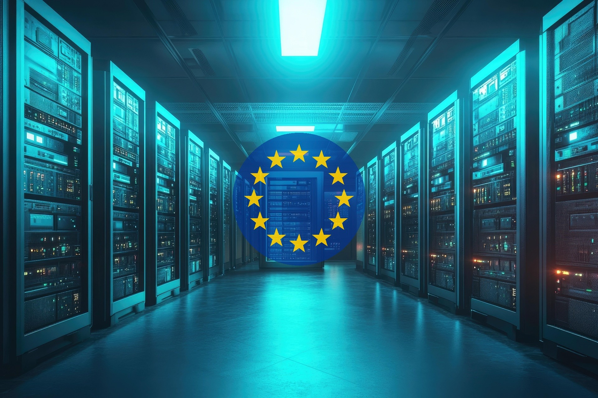
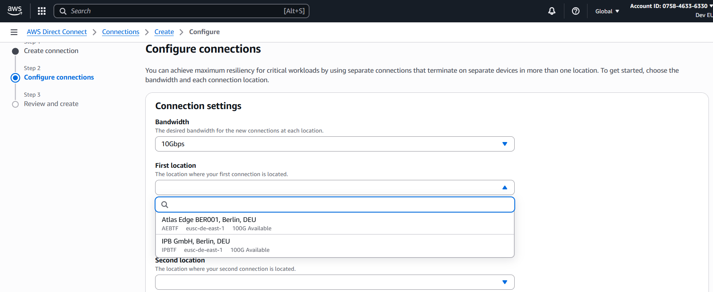
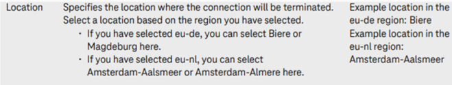

## Introduction

A few months ago, AWS introduced its AWS European Sovereign cloud. It is
delivered in the middle of a broader discussion about sovereignty, where
people seem to have very strong opinions: according to some people there
is just one option and that is to leave the American cloud providers as
fast as possible. Other people just wait and see. Or don't see any risks
for their organization. How to deal with these differences? Before making
this decision, organizations should weigh factors that are rarely discussed
publicly.

## Risks

Risk is based on both the chance that an event occurs and on the impact. When
you run your primary workloads in an American cloud, it can be frightening that
the US administration might read your data or stop your resources. Or make your
workloads inaccessible by, for example, shutting down network devices. The big
question is here: what should we defend ourselves against? What is real to
expect and what isn't?

Is it realistic to expect the US administration to shut down the access to a
whole region? Or will they limit themselves to the resources in individual
accounts/tenants? Is the data protected (enough) by the limitations that the
hyperscalers put upon themselves, or can we trust no-one when it comes to our
data?

When you listen to some (Dutch) politicians, there is just one solution for
(Dutch) governmental organizations and that is to move out of the American
clouds and go to European clouds. That sounds safe, because the Cloud Act
is not valid in those clouds, so this seems to be more secure than the
American cloud providers.

But is this the whole story? The hyperscalers have services in place that
defend users in the sovereign cloud against for example DDoS attacks. Via
honeypots they also figure out how attackers attack systems on the internet.
When an attacker tries to connect to their command-and-control server then
the access from any workload on that hyperscaler cloud to that hacker is made
impossible. Do European cloud providers have these security measures in place
as well? And, when they do, is the chance of hitting one of the European
Sovereign Cloud honeypots as high as hitting one of the honeypots of the
hyperscaler clouds? The idea that European Sovereign clouds are by default
more secure than non-European Sovereign clouds might not be true...

Another question is if European Sovereign Clouds are the solution to populist
governments. The USA is not the only country where populism is rising. The
AfD in Germany, RN in France, FvD in the Netherlands, they are all rising. What
will happen when populist parties become part of a government or elect a
president in one of these countries? Is the European Sovereign Cloud then a
safe place to be – or is another migration needed to a cloud in a different
European country?

## Functionality in the different clouds

Even when one would migrate to the AWS European Sovereign Cloud from the
current AWS global cloud, there are drawbacks when you compare them to the
global cloud. New functionality will become available later than in the global
infrastructure cloud and some functionality is not present (yet) or works
(slightly) differently.

One of the disadvantages of the European Sovereign Clouds is that their
maturity is less than those of the hyperscaler clouds: hyperscaler clouds have
a lot of functionality built in their services that European Sovereign Clouds
just don't have. That means that in some cases you have to implement these
features yourself. Both developing and maintaining this functionality costs
time, time that you cannot spend on developing your business applications.

One example of this is AWS Secrets Manager: it can be configured to change
passwords in Secrets Manager and then change the same password in for example
your MySQL database. Setting this up can be done in minutes. Implementing this
functionality in one of the European Government Clouds will cost time.

## Costs of migration

That brings me to the cost of migration. As with any migration, migrating to
the European Sovereign cloud costs time and money. It takes time to choose the
most appropriate European Sovereign Cloud for your use case. It takes time to
prepare the migration, test it in test environments, it takes capacity in the
organization that cannot be used to deliver new functionality or help
customers.

## Network and identity

When you want to be fully independent of the USA Government, you have to look
into the network and identity providers as well. Many companies rely on
Microsoft, either via Active Directory or via EntraID. EntraID is well secured
and has a lot of functionality that isn’t present in other Identity and Access
Management systems.

From a networking perspective, your organization might use American companies
like Equinix to connect from your on-premises environment to your cloud
provider.

When you want to be fully independent of American companies you should search
for an alternative solution here as well. In some cases (for example the AWS
European Sovereign Cloud) you might have to arrange a direct connection to
another country instead of being able to use a connection within your own
country.

  
Direct Connect locations for AWS European Sovereign Cloud

  
Direct Connect locations for T Cloud Public

## Emotions

When you listen to pro and cons of the European Sovereign Cloud, you hear a lot
of emotions. Anger and fear for the US Government. Anger at ourselves as
European organizations, that we didn’t choose for European Cloud providers from
the start.

Last month I tried to use a more rational approach, looking at pros and cons.
Looking at all kind of risks. But in the end, I had to admit that I also feel
emotions in these discussions. In my case I felt sadness, that I have to put
effort in learning about clouds that are less mature from a technical point of
view. It’s my job and I will do it – but it might influence my point of view.

Maybe we can agree that it’s just impossible to have a rational discussion on
this topic, just because one cannot determine the probability of any of the
risks?

## Conclusion

When you listen to some evangelists of the European Sovereign cloud, it’s all
very easy. The choice to migrate to the European Sovereign Cloud is easy –
because the impact of a decision of the US Government can destroy your
organization. The disadvantages of these choices are rarely mentioned. I think
that for some organizations it’s good to migrate to the European Sovereign
Cloud. For others, it just doesn’t make sense. It takes time and money to
investigate what is the best for your organization. From where I stand, the
discussion needs more reasoning and less emotions - we should at least try
not to look just at the impact but also look at the probability of that risk
and the costs and the disadvantages of a decision before making that decision.
And then agree that there really is no silver bullet in this discussion, take
a decision and live with the consequences.

===  
Image by [kp yamu Jayanath](https://pixabay.com/users/yamu_jay-44818947/?utm_source=link-attribution&utm_medium=referral&utm_campaign=image&utm_content=9088888)
from
[Pixabay](https://pixabay.com//?utm_source=link-attribution&utm_medium=referral&utm_campaign=image&utm_content=9088888).
I added the European stars via Claude.
