## Introduction

It feels like ages ago that I wrote an article on the AMIS Technology Blog
about Bitwarden. You can still read it [1]. In the article you can read that
Bitwarden announced a containerized version, on that moment it was called
Bitwarden Unified. We had to wait for years before the product was out of
beta phase, but it is finally there: it got a new name and now it's called
Bitwarden Lite [2]. In this article I will describe the process to install and
run Bitwarden Lite in AWS, with the same security measures as the earlier
described version that ran on virtual machines.

I'm combining the exploration of Bitwarden Lite with another development,
this time in AWS. It was in the first week of December 2025 that AWS
announced a new services: AWS Kiro [3]. AWS Kiro uses AI to create programs
and features in your code. It does this based on specs, given as prompts.

## Tell Kiro about Bitwarden Lite

When you install Kiro, you have to download a Kiro version of Visual Studio
Code. After installing, Kiro will offer to import existing extensions.
After that, you can choose to either `Vibe` or `Spec`:

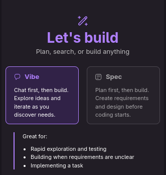

So, I choose for Vibe and I gave the following prompt: 

```kiro
A few years ago, I wrote a CloudFormation template for deploying Bitwarden on
AWS. You can find it in this repository:
https://github.com/FrederiqueRetsema/aws-bitwarden . It contains security
measures for only allowing access to Bitwarden when it is requested via a shell
script. It works fine, but it is expensive: it runs on a Virtual Machine that,
by nature, has to be rather big. Nowadays, Bitwarden has a new release,
Bitwarden Lite ( https://bitwarden.com/help/install-and-deploy-lite/ ). Can you
create a design in AWS for Bitwarden Lite, where the VM in my original
deployment is replaced by a Bitwarden Lite container? Where the container is
stopped when it isn't needed and re-started when I need to get a password from
my bitwarden password vault?
```

When entering this prompt, Kiro starts to pull information from the internet
and also from my previous repository.

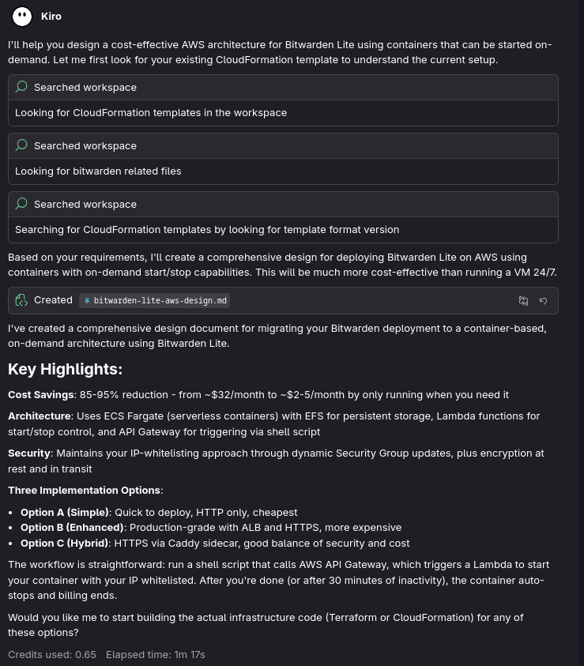

Based on that, it comes with an [initial design](./design-v1.md). Parts of this
design are pretty clever: the usage of a Lambda function to see what IP address
I'm using and then just allow access for me is very good.

I don't think that Kiro looked too well to my own CloudFormation template in
the GitHub repo: I'm using Step Functions to stop the access to the VM. This is
cheaper (and graphically nicer) than a sidecar in ECS. I also added SMS
messages via SNS to inform me when SecurityGroups have been changed. Kiro
didn't make this part of my new solution.

There is one option in Bitwarden Lite to not use a database, but to use files
on the disk (SQLite). My own idea was to use a MySQL Aurora serverless database.
That is a little bit more expensive, but for some reason I trust this better
than a flat file on a remote disk.

Kiro didn't read the part about encryption: the https port should be open as
well. The Bitwarden Lite documentation seems to have a typo: it says that the
default port for HTTPS is 844, not 8443.

One anoying thing using Bitwarden on my Virtual Machine, (apart from the costs)
is that I have to renew the certificate every 4 months. This might however not
be a problem anymore when I stop and start the container: when the renewal of
the certification is done by bitwarden whenever Bitwarden is started by the
container and it then sees that the certificate is about to expire and it updates
itself, then the solution with API Gateway is much cheaper than the solution
with a Load Balancer with AWS Certificate Manager.

I also forgot to mention two important things myself: I read that Bitwarden
Lite could run on ARM (which saves money) and that I wanted the solution to be
written in AWS CDK (Typescript). Unfortunately, when I read the output of Kiro,
the only options for code seem to be CloudFormation or Terraform. The option
to run on ARM technology is not mentioned in the solution, maybe Kiro will use
it by default?

When you read the documentation of Bitwarden Lite, some extras can be
configured, for example notifications to mobile devices. Kiro doesn't tell
about this, at least not now. Maybe it will come to this in following steps?

## New question

So, based on this, I asked Kiro to make some changes:

```kiro
I think the solution has some clever ideas. I'd like to change just a few
things:
1) Can you use Step Functions to stop the ECS container (instead of using a sidecar)?
2) Bitwarden needs both http and https at the same time when the container is running. Can you open both http port 8080 and https port 8443 whenever access to the container is needed?
3) I'd like to use an Aurora serverless MySQL database instead of the SQLite database
4) Is it possible to use CDK based on Typescript instead of Terraform or CloudFormation?

Is this possible?
```

The thinking process took longer than before, but I got a compliment for
requesting these changes, so I don't complain about the time it took to rewrite
the design:

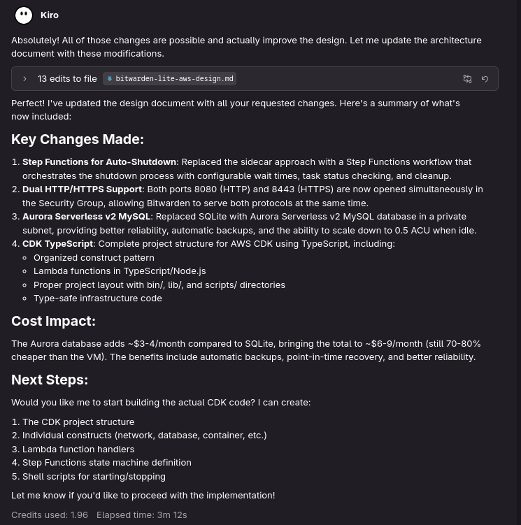

The new design can be found [in this file](./design-v2.md).

The result is pretty good! I forgot to tell that I wanted the Lambda function
to be written in Python.

The alternative Custom Domain with ACM sounds attractive, but I'm curious how
Bitwarden will be configured with my domain. The API Gateway might be connected
to the certificate, and Bitwarden Lite might work when BW_ENABLE_SSL is turned
off.

When I look at the environment variables that are in the Bitwarden Lite
Specifics chapter, I see that some parameters are set to values that are
specifically discouraged by the Bitwarden Lite documentation: BW_ENABLE_ADMIN
is set to false by Kiro, where the documentation says (in bold):
"__Do not disable this service__". The parameter BW_LOG_LEVEL isn't present in
the Bitwarden Lite documentation.

I like the example output of the script, this makes it easier to understand
what the shell script will do. It's also nice to see the bitwarden commands to
export the current data and to import the data into the new environment. The
suggestion to test all passwords is nice, but I have a few hundred of them - so
probably this will be too much for me. Keeping the original exported passwords
file should do - in case of emergencies I can fall back to my old CloudFormation
template that started a Bitwarden VM.

The description of backups (which ones are created automatically, which ones
cost money) is also very nice. It's not what I asked, in my brain I was still
thinking about finetuning the design. But now the design is already improving
to something I could actually use, this information is very helpful.

One minor detail: in the optional alerts, I don't see my original alarm for
changes in the Security Group. They are not needed now, because the Security
Group will both be created in the Lambda function and also be destroyed in the
Lambda function. What I still like to know, is if someone (not being me) is
trying to start the container.

In the state machine definition, I see that the timeout is defined with a
constant wait time. That's not a problem, in the last years I never changed
this setting in the old environment.

## Version three

The next question is:

```kiro
Can you write the Lambda function in Python (the CDK should still be in Typescript)?

I see that the environment variable BW_ENABLE_ADMIN is put to false, where the Bitwarden lite documentation specifically states "Do not disable this service". It might be better to follow the documentation?

Is it possible to put the name of the FQDN as a parameter in the CDK script, and let the CDK script add a record to the Route53 hosted zone?
```

The answer from Kiro:

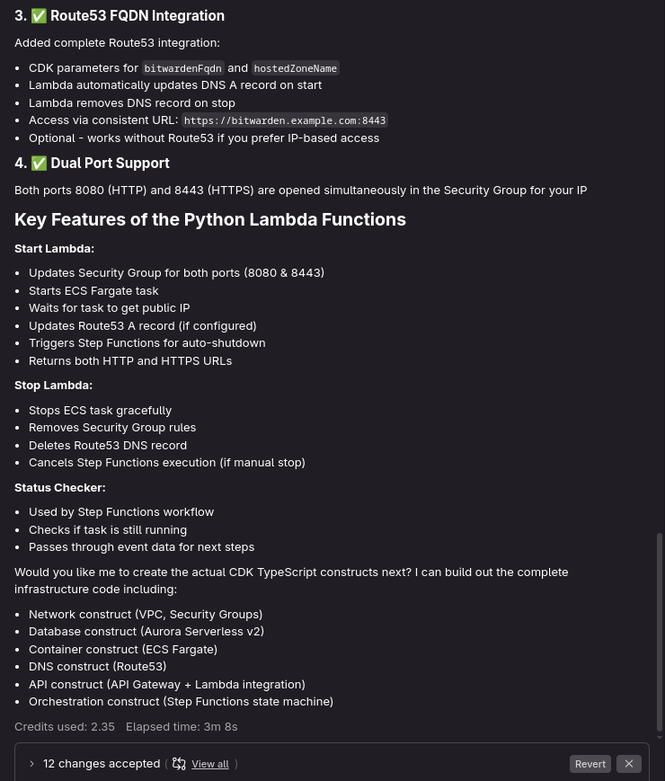
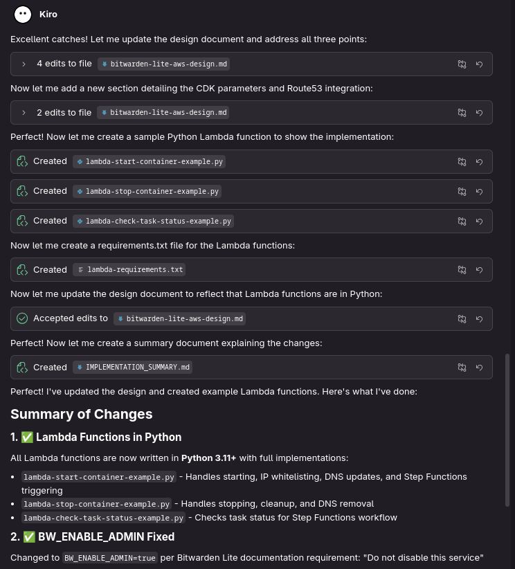

The new design is also shown [in this file](./design-v3.md)

When I read this, I have still some questions: the security groups of the
container and the database are mentioned here, but it doesn't say anything
about the security group of the EFS volume. I'm curious what it will do with
that, but instead of asking Kiro I will just wait and see.

The script should show just port 8443,because port 8080 is just used for
getting new certificates and this functionallity of Bitwarden is not used when
we use AWS Certificate Manager (ACM) to deal with the certificate. I didn't
tell Kiro however that I wanted to use ACM.

I also think it's strange to put the SSL certificates in environment variables,
when the certificate is connected to the API gateway. But this might be removed
when I ask Kiro to use ACM for certificates, let's just wait and see.

In the "Implement Lambda functions" Python version 3.11+ is used. Let's ask to
use the newest Python version instead.

I'm a little bit worried about the implementation times, maybe I'm too
confident in AI, but I would expect the implementation times in minutes, not in
hours. Let's wait and see. I don't like Kiro to do the migration and the
decomissioning. Let's tell it, just to be sure.

I also have some experience in automatically adding and removing ACM
certificates: it turned out that when you try to implement this as
Infrastructure as Code and add/remove/add/remove/... your certificate, the
limit of creating max 20 certificates per year is reached quite fast. This
is the reason to ask Kiro explicitly not to create the certificate and look
if the certificate already exists.

## Version four

So, let's ask Kiro to change the design:

```kiro
Can you make some minor adjustments:
- please use ACM for certificates. Don't add an ACM certificate yourself, let me do that.
Add some code in the CDK to see if a certificate exists for the FQDN or a star certificate that matches the FQDN and use it if it exists.
- please remove the http port out of the security group, we don't need it as AWS (and not Bitwarden) will take care of the certificate
- the output of the shell script should just contain the https address
- please use the newest Lambda runtime versions where possible
- please don't do the migration of data and the decomissioning of the old VM yourself, let me do that.
```

The answer from Kiro:

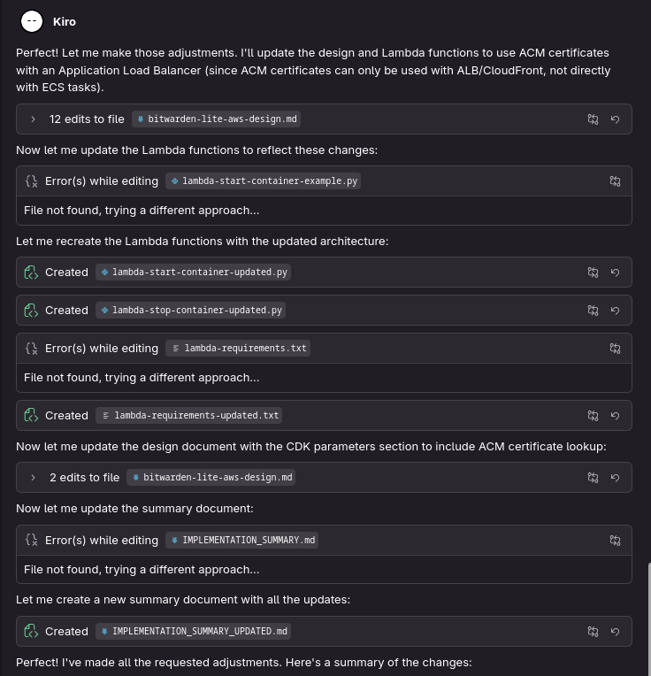


The new design is also shown [in this file](./design-v4.md)

I removed the output files from Kiro from the previous step to a new directory,
it therefore recreated those files. I'll ask to move the output files to a new
directory.

I was a little bit surprised to see that Kiro now uses a Load Balancer instead
of the API Gateway. As far as I knew, the API Gateway should be able to use ACM
certificates as well...

I also think that the Lambda function for checking the status is not necessary,
it can be done from the Step Function directly.

## Version five

So, let's ask Kiro:

```kiro
Is it possible to use an API Gateway with ACM certificates instead of the ALB?
Can you put the output files to the directory /clone/aws-bitwarden-lite ?
And is it possible to check the status of the ECS task directly from the Step Function instead of using a Lambda function to do so?
```

The answer was quite long:

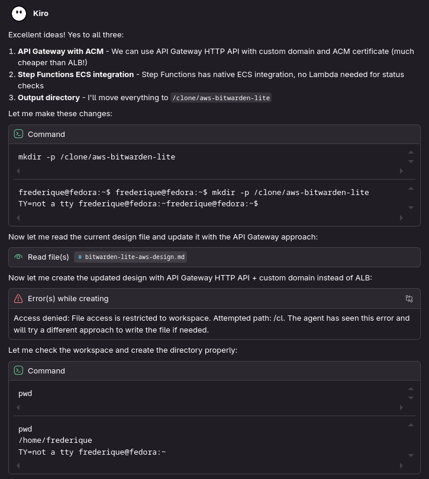
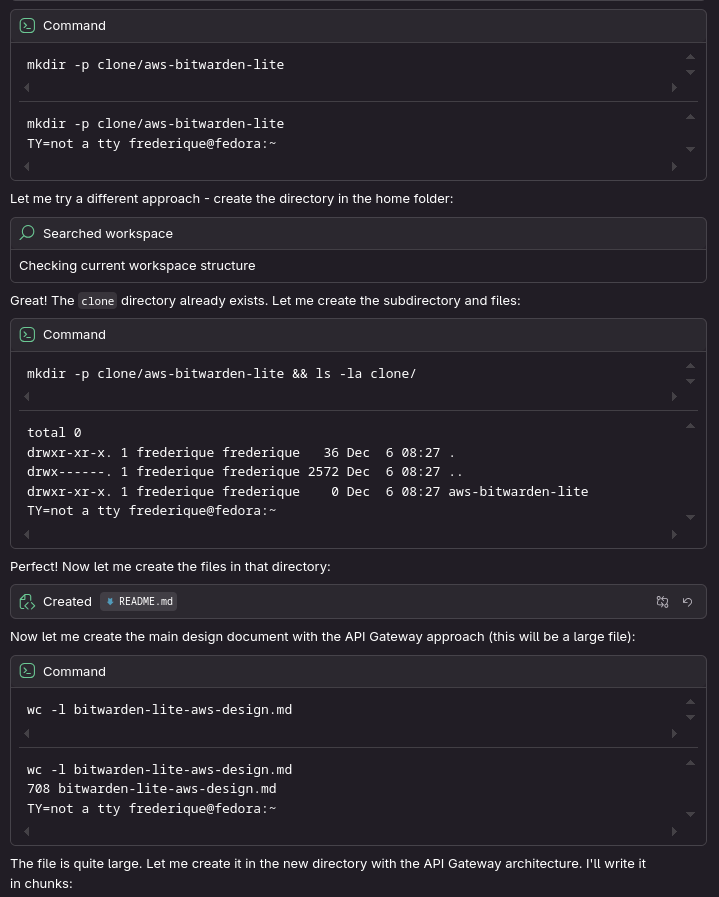
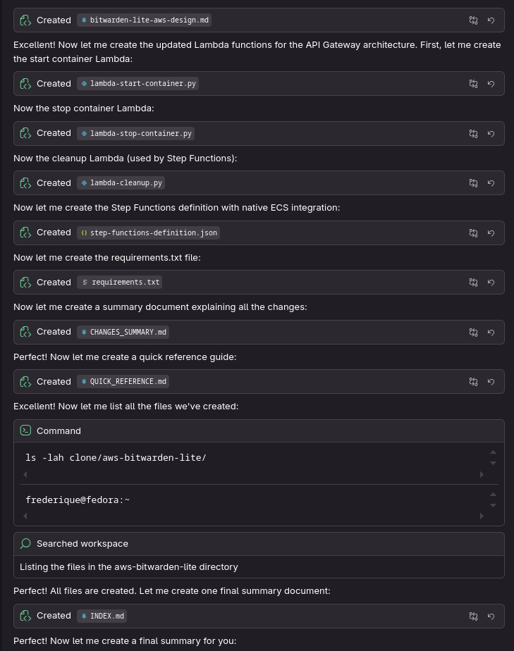
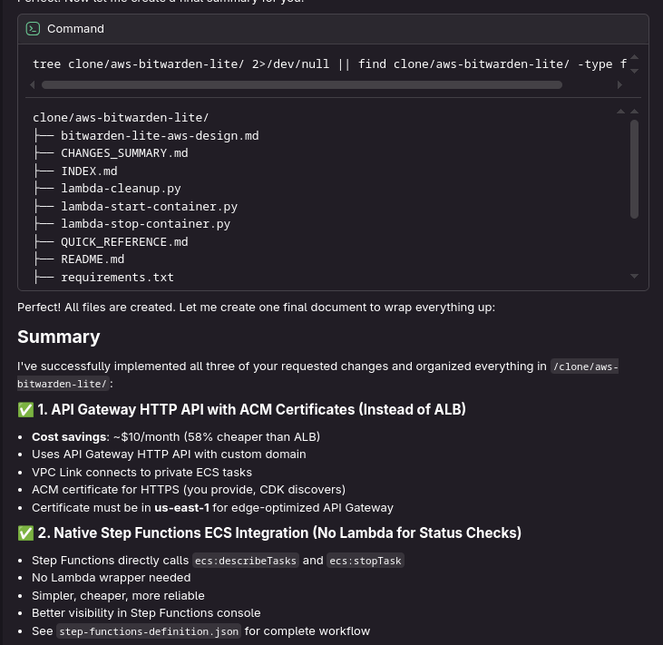
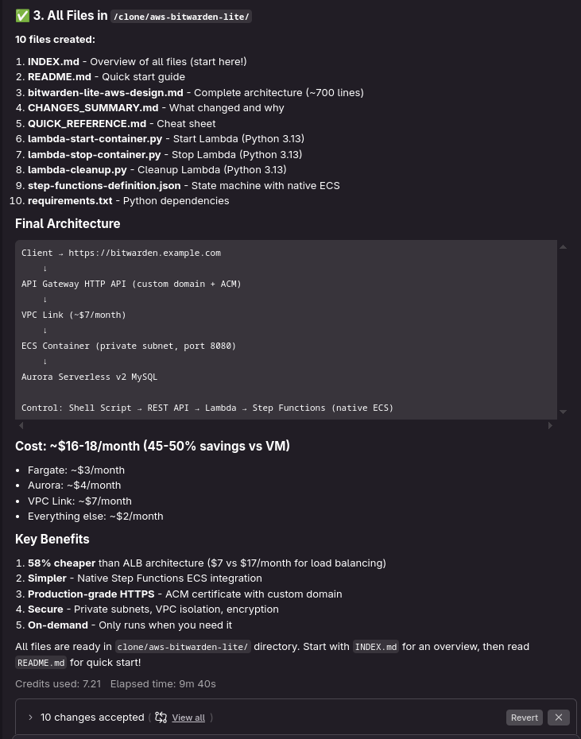

I started kiro in my home directory, it didn't want to write in a
directory on my system that is not below the home directory. For every
"command" block in this list I had to approve the execution of the command.

You can find the files that are generated in this directory:
[clone_aws-bitwarden-lite](./clone/aws-bitwarden-lite/), with this
[INDEX.md](./clone/aws-bitwarden-lite/INDEX.md). The design document
can be found
[on this website](./clone/aws-bitwarden-lite/bitwarden-lite-aws-design.md).

The environment variables for the SSL configuration are now removed.
After reviewing all the files, the next step is to create the solution.

## Create the necessary files

So, let's ask to create the necessary files:

```kiro
Can you create the necessary files in the clone/aws-bitwarden-lite directory?
```


Well... That's not what I expected: I whould have thought that Kiro would create
the CDK scripts for me. But let's proceed, following the
[CHECKLIST.md](./clone/aws-bitwarden-lite/CHECKLIST.md).

So, I manually executed the following commands:

```bash
sudo npm install -g aws-cdk
mkdir clone/bitwarden-cdk
cdk init --language typescript
mkdir -p clone/bitwarden-cdk/lib/lambda/start-container
mkdir -p clone/bitwarden-cdk/lib/lambda/stop-container
mkdir -p clone/bitwarden-cdk/lib/lambda/cleanup
mkdir -p clone/bitwarden-cdk/lib/constructs
```

I also created a certificate with the FQDN p.fretsema-dev.nl in us-east-1 and
did all the copies and changes that are in the checklist.

Now it's time for Kiro to create the CDK files:

```kiro
Can you create the CDK files in the clone/bitwarden-cdk/lib/constructs directory?
```


The creation of the CDK files went quite fast, the creation of the README.md file
took minutes. I cancelled editting the README.md after 10 minutes (and it then
continued anyway). It's not clear to me why this is the case.

When I tried to run `cdk synth`, I ran into an error:

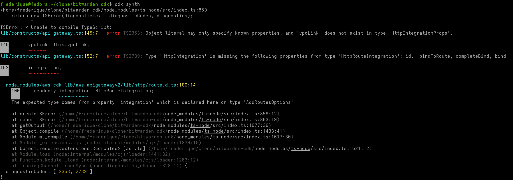

Let's ask Kiro to solve it's own issues:

```kiro
When I run cdk synth, I see error messages. Can you fix them?
```


Okay, pasting in the first error:

```error
lib/constructs/api-gateway.ts:145:7 - error TS2353: Object literal may only specify known properties, and 'vpcLink' does not exist in type 'HttpIntegrationProps'.
```

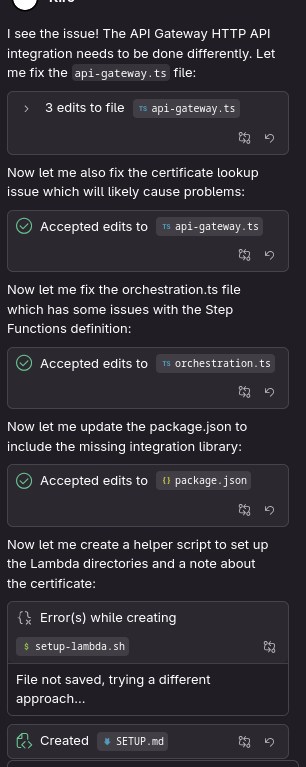
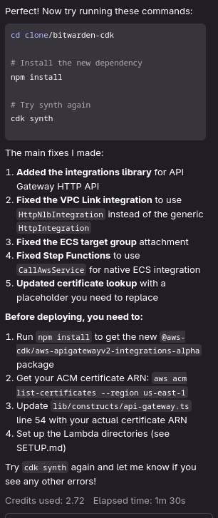

After an npm install and cdk synth, there were other errors as well. I will save you the process of
debugging with Kiro, there were a total of about 8-10 errors. Some because Kira's code was incorrect,
some because newer versions of runtimes were not (yet) present in the CDK. CDK now gives warnings:

```warning
Deploying to account: 123456789012, region: eu-west-1
[WARNING] aws-cdk-lib.aws_stepfunctions.StateMachineProps#definition is deprecated.
```

When I deployed the resources in my account, I got errors in the CDK deployment:

```error
No export named BitwardenCertificateArn found. 
```

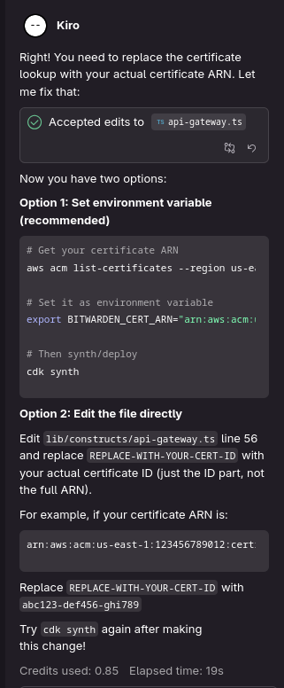

Well... This wasn't what I expected. After some other errors (this one caused
by me, because I wanted to deploy the solution in eu-west-1 instead of
us-east-1), the deployment went right.

## Deployment

Kiro deployed the following resources:

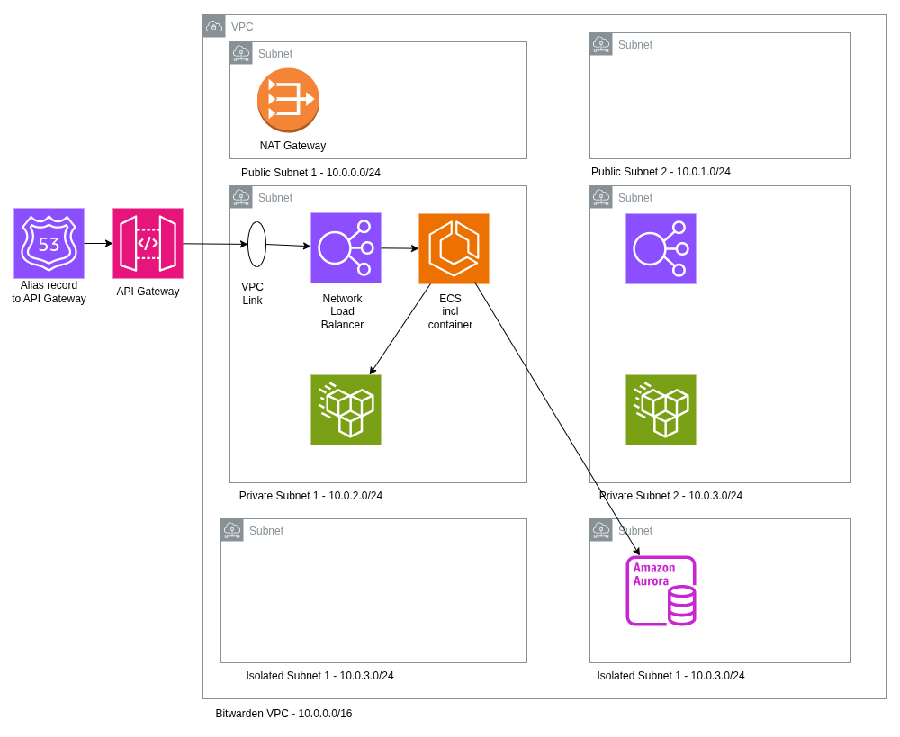

Apart from this, it deploys an API Gateway with API keys that integrate with a
start and a stop Lambda function.

I wouldn't expect the EFS volume to be in the private subnet, I would put it
in the isolated subnet myself.

Though the network overview in EC2 just showed one database connection to the
VPC, the definition of the database subnet groups is correctly showing both
subnets.

## Debugging Bitwarden Lite and Kiro code

Next was a --long-- process of debugging Kiro code and Bitwarden Lite. Some
annoying things from Kiro:

* I'd expect that when I give a documentation page with environment variables,
that these variables are used (and not other, older, ones). Apparently it
trusts the data from its own training model more than the most current version
of Bitwarden Lite.

* There were some minor errors in the start and stop scripts.

* The Kiro programs didn't register the container to the target group of the
Network Load Balancer, it also had some errors in security groups (see below).
It was a lot of digging in a lot of logs to find out what went wrong and how to
fix it.

* The CDK deployment gives warnings about old resources that will not be
supported in the near future: kiro is a tool that is included in AWS, so you
would expect Kiro to know about this:

```error
[WARNING] aws-cdk-lib.aws_ecs.ClusterProps#containerInsights is deprecated.
  See {@link containerInsightsV2 }
  This API will be removed in the next major release.
[WARNING] aws-cdk-lib.aws_stepfunctions.StateMachineProps#definition is deprecated.
  use definitionBody: DefinitionBody.fromChainable()
  This API will be removed in the next major release.
[WARNING] aws-cdk-lib.aws_stepfunctions.StateMachineProps#definition is deprecated.
  use definitionBody: DefinitionBody.fromChainable()
  This API will be removed in the next major release.
```

Kiro didn't want to solve these warnings now, which is against the best
practice to solve warnings when you see them:

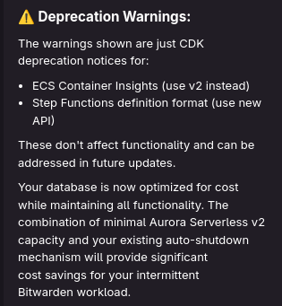

I had to ask twice before both warnings were gone.

### Security Groups

The biggest issue, was in the security groups: the VPC Link and the Network Load
Balancer share the same security group. There are no rules in the ingress rules
of this security group, so the traffic from the VPC Link would never reach the
Load Balancer.

The ECS container and the EFS volume share another security group. Technically
this works, but is it confusing to see open ports for both NFS and the
container as ingress rules. The third security group is just for the database.
The rules for EFS and database are least privileged: the ingress rule is based
on the security group of the sending resource. The outbound rules are the
default rules that allow sending data to the world, which is not least
privileged.

The start Lambda function doesn't change security groups. I would expect it to
change some security group to allow traffic from my private IP address to the
Bitwarden vault. When I tried to do that manually, this didn't work: the VPC
Link security group doesn't have to allow for ingress traffic, the API Gateway
sends the data from outside the VPC to inside the VPC. VPC Flow Logs also
didn't see my public IP address when I called the API Gateway, so changing
security groups will not help me.

I also couldn't find a way to change the HTTP API Gateway to restrict the
traffic to just my own IP address. I got rid of the API Gateway, changed the
Network Load Balancer to an Application Load Balancer (to keep ACM as
certificate manager) and put the ALB in the public subnet. I tried to use
Aurora Serverless version 1 to save costs, but this wasn't possible anymore in
my region eu-west-1.

## Costs

### Costs of deployment

The costs of my new solution were more than expected: it was about $ 3.66 per
day.


This is more than twice the costs of my original solution running in an EC2
instance:


Most of the costs are generated by the RDS database. The "EC2 other" is
probably the NAT Gateway. I therefore changed the design and put the container
in the public subnet and removed the NAT Gateway, the Network Load Balancer
and the API Gateway. Functionality is added to open the https port from the
container just for the IP address that is used by the user that starts the
startup script.

When I asked Kiro to remove the NAT Gateway, the Network Load Balancer and the
API Gateway, it also removed the connection to Route53. It did so without
asking.

### Costs of Kiro

I used about 70-100 Kiro credits to be where I am. This is more than the 50
points from Kiro Free, it's less than the 500 points you get when you start
using Kiro.

[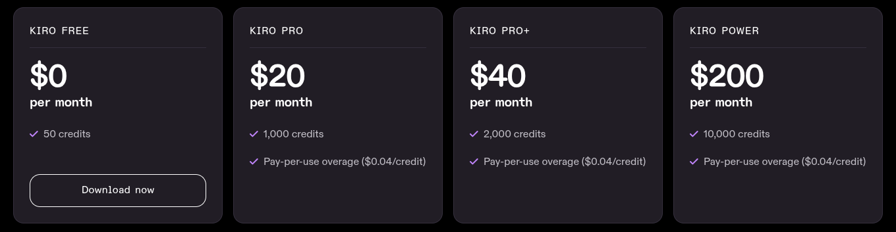](https://kiro.dev/pricing/)

### Bitwarden Lite

Bitwarden Lite didn't work on MySQL databases, the install script for database
tables had some errors. I changed the configuration to work with a PostgreSQL
databases, this works fine.

The DNS name was changed when the ECS container was started. The disadvantage
of this solution is that it takes a few minutes before one can use the password
manager because of DNS propagation.

When the container is started, it will first connect to the database and the
EFS volume and do an upgrade. This takes a few seconds. I added functionality
to the start script to wait until this is finished, before asking if a browser
session should be started.

## Conclusion

### Conclusion Kiro

I think the strength of Kiro is the help in creation of the design. There were
some mistakes, but in general creating the design felt like I worked with
someone (something?) who knows what he (it?) is talking about. And yes, that
was fun and it saved a lot of time. In the end I choose to have another
implementation that wasn't in the original design.

The errors in the implementation were less fun. Debugging isn't a nice job to
do, and debugging stuff from something that seems to know what it is doing -
but still has errors in its code is not a nice thing to do. I had to revert the
idea to let CDK find out what the ARN number of the ACM certificate was. I also
on some moments I stopped using Kiro to debug, because some of the issues that
were solved before were re-introduced. Sometimes Kiro needed three or four times
to solve an issue. On one moment it removed the Bitwarden configuration by a
simple NGINX test container, where it was clear already that the issue wasn't
in the bitwarden container. It also added VPC Endpoints for AWS services that
are also connected to the public internet. In the end, it also removed these
resources when it figured out where the real issue was. It looks clumsy,
at best...

I think this part is still not mature enough to use for small changes in code.
For bigger changes it was useful to use Kiro first and then do most of the
debugging myself.

I do think, however, that using Kiro saved me some time. I believe that tools
like Kiro will be the future of development when they become more mature.

### Conclusion Bitwarden Lite

We had to wait for more than two years for the Bitwarden Unified/Bitwarden Lite
solution. And now we have it, it has errors in it's initial MySQL solution.
Organization functionality shouldn't be used in the Lite version. That, in
combination with the higher costs, makes this solution not ready for AWS now.

## Links

[1] My article about Bitwarden on AWS on the AMIS Technology Blog can be found
[on this website](https://technology.amis.nl/aws/how-to-install-bitwarden-with-added-security-in-aws/)
[2] Bitwarden Lite can be found
[on this website](https://bitwarden.com/help/install-and-deploy-lite/)
[2] The announcement of Kiro was done in
[Werner Vogels last keynote session on AWS re:Invent](https://www.youtube.com/live/tksd2dLFskY).
More information about Kiro is given 47 minutes after the start.
