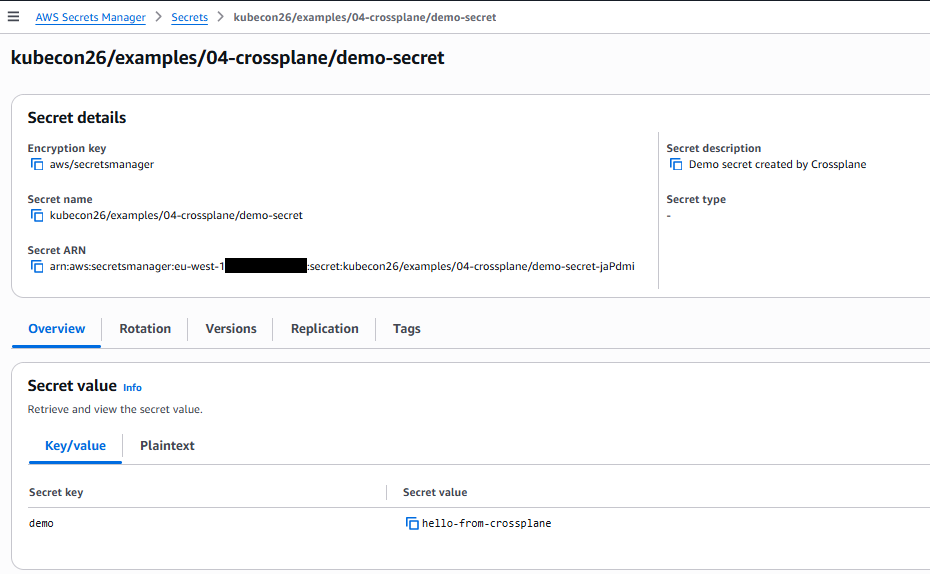

## Introduction

I like big conferences: you can get a lot of knowledge in a very short time.
During the Kubecon conference in Amsterdam in March 2026, I maintained a list
of what I wanted to learn after the conference. In the weeks after Kubecon, I
tried to recreate the examples in the AWS play environment. In this case: a
vanilla implementation of Kubernetes with one control node and two worker
nodes. In this blog some of the lessons I learned.

You can deploy the examples in your own AWS environment as well, this is
[the link to the repository](https://github.com/FrederiqueRetsema/Kubecon26-example-repo)
Go to the `aws-deployment` directory, copy the `setenv.template.sh` file to
`setenv.sh` and change the values in the file. Then start the environment
with

```
bash login.sh
bash start-k8s.sh
```

You can delete the environment by
```
bash stop-k8s.sh
```

## 01 - Gateway API instead of Ingress

It was an official moment in the Kubecon presentation: the archival of the
[ingress-nginx](https://github.com/kubernetes/ingress-nginx) repository. We
now should migrate to the new Gateway API implementations. There are two
tools that can help you: the first one is called
[ingress2gateway](https://github.com/kubernetes-sigs/ingress2gateway) and it
can help you in migrating the current ingress-nginx implementations to a
Gateway API implementations. The second one is an
[implementation wizard](https://gateway-api.sigs.k8s.io/docs/implementations/wizard/):
when you don't know which implementation support which features you can click
on the features that you must have, or which ones are nice to haves, and
then a list of tools that support these features comes up.

In the talk "Gateway API: Bridging the Gap from Ingress to the Future" (
[slides](https://kccnceu2026.sched.com/event/2EsAI/gateway-api-bridging-the-gap-from-ingress-to-the-future-nick-young-james-strong-isovalent-at-cisco-katarzyna-lach-rostislav-bobrovsky-google-norwin-schnyder-airlock?iframe=no),
[video](https://www.youtube.com/watch?v=_4JkNbuA2Gg)) the presenters
showed both the way of working with new ListenerSets, TLSRoutes in both
Terminate and Passthrough mode, mTLS, HTTP2 Connection coalescing and
the Gateway client certificate selection API.

In my example repository I have examples for the new ListenerSet and
the two ways of working with TLSRoutes.

## 02 - Refresh secrets

The ArgoCD team gets a lots of questions to implement support for secrets
in the ArgoCD environment. They don't want to implement it, because secrets
should be kept in a vault (f.e. Hashicorp Vault, Azure KeyVault, AWS Secrets
Manager, etc). When the password changes, the
[External Secrets Operator](https://external-secrets.io/latest/) will
keep the secret in Kubernetes up-to-date automatically. As an developer,
you can use libraries like fsnotify (for go) or watchdog (for python) to
check if a file is changed. For other programming languages see slide 26 of
the talk "
[GitOps and Secrets:State of the Union](https://colocatedeventseu2026.sched.com/event/2DY22/gitops-and-secrets-state-of-the-union-kostis-kapelonis-octopus-deploy)
". The presenter, Kostis Kapelonis, also created a
[simple repository](https://github.com/kostis-codefresh/external-secrets-gitops-example)
to show how this works.

I implemented his solution in my own environment as well.

## 03 - Refresh secrets AWS

With my background in AWS, I liked to know how this worked with secrets in AWS.
I liked the idea of automated change of secrets a lot, so I woundered if
something like this would exist for parameters as well. I would like to get an
operator that "translates" AWS SSM parameters to ConfigMaps. Unfortunately this
doesn't exist (yet), but you can use External Secrets Operator to translate
SSM parameters into Kubernetes secrets. Which might be somewhat confusing.

In the example repository you will find both examples for External Secrets
Operator connections with AWS Secrets Manager and with SSM Parameter Store.

## 04 - Crossplane

### Learning Crossplane

The External Secrets Operator can be used to get secrets and parameters from
AWS into Kubernetes. But it can be done the other direction as well: we
can add SSM parameters and secrets from Kubernetes to AWS. This might be done
via Crossplane. I saw the video on the [crossplane](https://www.crossplane.io/)
website before the conference, but didn't have time to look into it further.

The talk on the conference ("
[Crossplane - The Cloud Native Framework for Platform Enginering"](https://hosted-files.sched.co/kccnceu2026/c5/Kubecon+EU+2026+Crossplane+Maintainer+Talk.pdf)
then went a little bit too fast for me... When I was home I took more time
to look into it more properly: I first followed the demos on the Crossplane
site and put the files in my example repository.

### Creating SSM parameters and secrets

When I created crossplane objects for an SSM parameter and a secret, there
are some differences in the way Crossplane deals with these objects. The way
that Crossplane refers to AWS objects is also different: for SSM parameters
this works via annotations:

```
apiVersion: ssm.aws.m.upbound.io/v1beta1
kind: Parameter
metadata:
  name: crossplane-demo-parameter
  annotations:
    crossplane.io/external-name: /kubecon26/examples/04-crossplane/demo-parameter
spec:
  forProvider:
    type: String
    insecureValue: hello-from-crossplane
    region: eu-west-1
```

For secrets, this is via a (Kubernetes) secret name parameter in forProvider:

```
apiVersion: v1
kind: Secret
metadata:
  name: crossplane-demo-secret-value
  namespace: default
type: Opaque
stringData:
  secret-string: '{"demo":"hello-from-crossplane"}'
---
apiVersion: secretsmanager.aws.m.upbound.io/v1beta1
kind: Secret
metadata:
  name: crossplane-demo-secret
spec:
  forProvider:
    name: kubecon26/examples/04-crossplane/demo-secret
    description: Demo secret created by Crossplane
    region: eu-west-1
---
apiVersion: secretsmanager.aws.m.upbound.io/v1beta1
kind: SecretVersion
metadata:
  name: crossplane-demo-secret-version
spec:
  forProvider:
    region: eu-west-1
    secretIdRef:
      name: crossplane-demo-secret
    secretStringSecretRef:
      name: crossplane-demo-secret-value
      key: secret-string
```

This leads to:



It would be better to use one way-of-working for this within Crossplane.

When you use the newest versions (on the time of writing this blog), it is not possible to put
values in SecureStrings in SSM parameters or in SecretValues in secretsmanager. These have to be
pulled from a kubernetes secret. The Kubernetes secret for the SSM parameter can be put in the
namespace of the application, the secret for secretsmanager should be in the default
namespace (which is not what one would expect when one deploys the solution).

When you delete a secret and then recreate it, you might get an error message that says:

```
failed to create the resource: [...] creating Secrets Manager Secret
(kubecon26/examples/04-crossplane/demo-secret): operation error Secrets Manager: CreateSecret,
https response error StatusCode: 400, RequestID: 1ab23456-7890-1cde-fgh2-34i5678jkl9m,
InvalidRequestException: You can't create this secret because a secret with this name is already
scheduled for deletion.
```

This can be solved by using the AWS CLI:

```
aws secretsmanager delete-secret --secret-id kubecon26/examples/04-crossplane/demo-secret --force-delete-without-recovery --region eu-west-1 --profile your-profile
```

### Crossplane CLI

I then tried to follow along with the Kubecon demo in
[this repository](https://github.com/adamwg/kubecon-eu-2026-devex-demo), but the PR was
already merged and some commands were different than those in the repository. I could follow
along using the following commands on the control node of my AWS kubecon26-example-repo:

#### Setup
```
# This commands are done for you
cd /clone
git clone https://github.com/crossplane/cli

cd /clone/cli
go install ./cmd/crossplane
PATH=$PATH:/home/kubernetes/go/bin
```

#### Demo Script

You can follow along with the rest of the demo, executing

```
crossplane project init hello-amsterdam && cd hello-amsterdam
```

from the `~/kubernetes` directory.

In step 7, use v1.34.0 instead:

```
crossplane dependency add k8s:v1.34.0
echo
echo "Here's what crossplane-project.yaml looks like after adding the dependency:"
echo
cat crossplane-project.yaml
```

In step 10, don't use the --crossplane-version argument:

```
crossplane composition render --timeout=10m examples/webapp/podinfo.yaml apis/webapps/composition.yaml
```

In step 14, use curl instead of open:

```
kubectl port-forward svc/$(kubectl get svc -l crossplane.io/composite=podinfo -o jsonpath='{.items[0].metadata.name}') 9898 >/dev/null 2>&1 &
curl http://localhost:9898
```

It was very nice to see that using crossplane is made easier by just having to add the relevant
code and let the crossplane CLI do the rest.

## 05 - OpenTelemetry

In Kubernetes services can be slow, which can be cause by calls to the DNS. I liked the talk
about "
[DNS Tracing and Metrics Via eBPF in OpenTelemetry](https://kccnceu2026.sched.com/event/2CW5C/dns-tracing-metrics-via-ebpf-in-opentelemetry-endre-sara-causely-nikola-grcevski-grafana-labs?iframe=no)
". Sometimes the slowness is not caused by the DNS server, but by the DNS clients: maybe
by not using the FQDN of the server. But where does this happen?

We can find out by using OpenTelemetry eBPF Instrumentation (OBI). Both metrics
and spans are supported. I added the configuration for eBPF and OpenTelemetry in
the example repository.

You can look at the dashboard DNS Requests (eBPF) for DNS requests within this
cluster.

I was a little bit surprised that the DNS requests were not visible in the same
way as in the Kubecon presentation. The reason was, that both Python and (the
current implementation of) go have libraries that add search paths to the URL
when no dots are present. The first search path to add is
`05-opentelemetry.svc.cluster.local`, which is the correct one for
my service.

I changed the script a little bit to add different paths. This is the result:


## 06 - Policy Engines

One of the nice things of Kubecon is that some presentors give overviews of different solutions
for the same problem. The presentation
[Policy Engines for Kubernetes: Picking One Without Losing Your Mind](https://kccnceu2026.sched.com/event/2CW0S/policy-engines-for-kubernetes-picking-one-without-losing-your-mind-nabarun-pal-broadcom)
by Naburan Pal did just that. He did a great job of showing code, advantages and disadvantages
of four policy engines: ValidatingAdmissionPolicies, Kyverno, OPA/Gatekeeper and Kubewarden.

I implemented three of four in my example repository: Kubewarden is used less in the community
and has a different architecture so I left this one out.

## Conclusion

It helped me to play with knowledge I learned from conferences like Kubecon. You can do as well,
by using [the example repository](https://github.com/FrederiqueRetsema/Kubecon26-example-repo).

Have fun!
