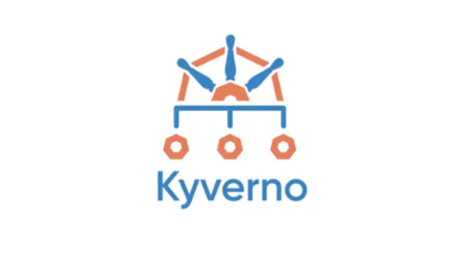
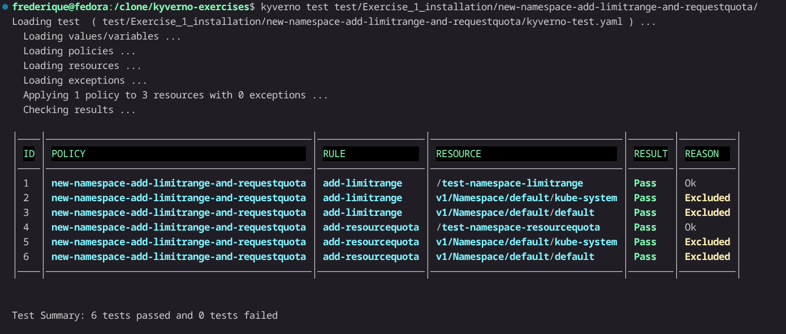

## Introduction

I have quite some certifications, also from the CNCF. Three of the CNCF
certifications (CKAD, CKA and CKS) are exercises that you have to execute
in an exam environment. This also means that the way I learn for these
exams is different than the way I study for exams like KCA (Kyverno Certified
Associate) that are multiple choice. And that's a pitty: I missed the
hands-on experience. But then I thought: what would I like to do with
Kyverno? And then the idea for a list of exercises came up.

## Different solutions for the same exercise

When I looked at the documentation of Kyverno, it turns out that Kyverno is in
the middle of a change of the way specifications should be written: it turns
out that CEL is the new standard and that there are new CRDs (Custom Resource
Definitions) as well. Though the curriculum of KCA is two years old, it's not
clear if the CEL based way of working made it into the exam. And even if this
isn't the case, it's always nice to work according to the newest best
practices. I therefore wrote the answers to the exercises both in the old and
in the new formats. I also wrote tests for all solutions. You can use the same
minikube cluster for all the exercises.

## Exercises

Okay, here they come:

### Exercise 1: Installation

Installation and policy to change new namespaces:

* Use Minikube to start a new cluster:

  ```bash
  minikube start \
        --profile kyverno-exercises-dev \
        --cpus 2 \
        --memory 4096 \
        --cni cilium
  ```

* Install Kyverno 1.18.0 (or any other version that support both the old and
  the new formatting standards) on this cluster
* Add the Pod Security Standards Kyverno templates to your cluster
* When a new namespace is created, I'd like to automatically add
  `ResourceQuota` and `LimitRange` resources to this namespace. (For this
  excercise, it doesn't matter too much which values you use for the content
  of these resources)
* Forbid to create objects in the default namespace (for now, just scan on
  pods, services and deployments)

* Try to create them both in the "old way" and the "new (CEL-based, based on
  new CRDs) way"
* Create test sets for all Kyverno resources

### Exercise 2: cost allocation

* Create a validation policy that checks if the `comp.department` annotation
  has valid values: it should be one of `ict`, `sales`, `logistics` or
  `marketing`
* Create a validation policy that checks if the `comp.cost-center` annotation
  has valid values: it should be one of `CC0001`, `CC5020`, `CC7102` or
  `CC9000`
* Create a mutation policy: when cost center or department are not present,
  use the cost center and/or department of the namespace

* Try to create them both in the "old way" and the "new (CEL-based, based on
  new CRDs) way"
* Create test sets for all Kyverno resources

### Exercise 3: help your security department

* You have a certain bug that just accurs with nginx version 1.31. You'd like
  to get a list of pods or deployments that currently use that version of
  nginx. (The latest version of nginx is newer than version 1.31).
* An employee that didn't function too well thought: "let me please my
  colleages". He added randomly annotations you_will_be_fired_too: "true"
  to different types of resources. You want a list of resources that have
  this annotations.

* Try to create them both in the "old way" and the "new (CEL-based, based on
  new CRDs) way"
* Create test sets for all Kyverno resources

### Exercise 4: webhooks

* Check all images that are used in your cluster with Trivy regularly
  (Assume that all resources are deployed using deployments)
* Check if all images are verified, show one example that is and one example
  that isn't verified
* Show the Kyverno UI to see which resources are valid and which resources
  are not.

* Try to create them both in the "old way" and the "new (CEL-based, based on
  new CRDs) way"
* Create test sets for all Kyverno resources

### Other tests

* In the Dynatrace Community someone also made
  [a challenge](https://community.dynatrace.com/t5/Challenges/%EF%B8%8F-Take-the-Lex-Imperfecta-Challenge/ba-p/301931)
  , Thank you
  [Marina Pollehn](https://conclusionxforce.cloud/author/marinapollehn/) for
  pointing me to the Dynatrace community!

## Solutions

You can find the solutions to these exercices (except for the Dynatrace one,
of course ;-))
in my [github repo](https://github.com/FrederiqueRetsema/kyverno-exercises).

Some remarks:

* __Exercise 1__: When you use preconditions (like I did in the namespaces
  exercise) you can see in the output that the test passes, but the Reason is
  "Excluded". It turns out, that you can put both "pass" and "skip" in the
  result of the test:

  ```yaml
  - policy: new-namespace-add-limitrange-and-requestquota
    rule: add-limitrange
    resources:
      - kube-system
    kind: Namespace
    result: skip   # pass is also allowed
  ```

  Of course it is better to use skip here.

  

* CEL vs non-CEL: in some cases the new way of working isn't correct, for
  example in the tests for creating new resources for new namespaces. The
  mutation policy for the last exercise also doesn't work in the CEL based
  variant (yet).
